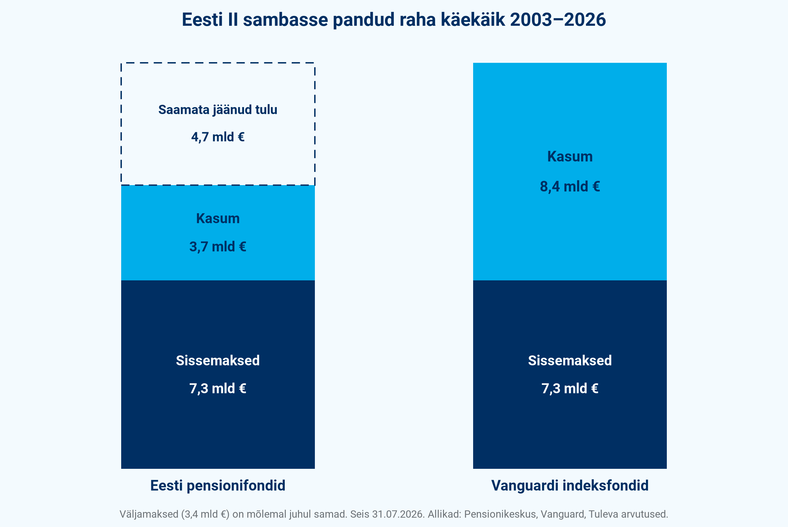

# Miks John C. Bogle meie pankade fondijuhtide jutu peale muigaks?

Õigustades pensionifondide viletsust, on pangad meile aastaid rääkinud, et riik on raha paigutamist liiga karmilt piiranud. Miljoneid inimesi jõukaks teinud Bogle tõestas, et tulu toovad just rangemad investeerimispiirangud.

## Radikaalselt rangete investeerimispiirangutega fond

50 aastat tagasi, 31. augustil 1976 asutas Bogle investeerimisfondi, mis erineski teistest just jäikade reeglite poolest. Fondijuhi otsustada ei jäänud praktiliselt midagi. Tema ülesanne oli lihtsalt osta USA viiesaja suurima ettevõtte aktsiaid. Regulaarselt ja täpselt sellises proportsioonis nagu kirja pandud nimekiri ehk **indeks** ette seadis. Ei mingit kavalust ega ennustamist.

Maailma esimene tavainvestoritele mõeldud indeksfond **Vanguard 500** on tänaseks üks maailma suurimaid ja tootluse poolest edukamaid investeerimisfonde. Selles on ligi 1,7 triljonit dollarit. Kes pani 1976. aastal fondi 10 000 dollarit, sellel oli 2026. aasta kevadeks ligi 2 miljonit: keskmiselt 11,4% aastas, ilma et keegi oleks pidanud midagi ennustama.

## Vanguardis kogudes oleksime ligi viie miljardi võrra rikkamad

Kui meie, Eesti inimesed, oleksime saanud algusest peale panna oma II samba vara Vanguardi indeksfondidesse, oleksime täna ligi **4,7 miljardi euro võrra rikkamad**. Iga praeguse II samba koguja kohta teeb see keskmiselt üle 9000 euro.

Ligi 24 aastaga, 2002. aasta lõpust 2026. aasta juulini, oleme II sambasse maksnud kokku 7,3 miljardit eurot. Fondidest on selle ajaga välja läinud 3,4 miljardit: suurem osa sellest on 2021. aasta reformi järel välja võetud raha, lisaks pensioniväljamaksed ja pensioni investeerimiskontole viidud vara. Fondides on täna 7,7 miljardit. Eesti pensionifondid on meile seega teeninud 3,7 miljardit eurot kasumit. Samad sisse- ja väljamaksed Vanguardi indeksfondides oleksid teeninud 8,4 miljardit ehk üle kahe korra rohkem. (1)

Sama asja saab öelda ka nii: Eesti pensionifondidesse pandud raha on kasvanud keskmiselt 5,4% aastas. Vanguardi indeksfondides oleks see kasvanud 9,1% aastas.

## Vähem piiranguid pole tegelikult paremat tootlust andnud

Nõrgas tulemuses on süüdi seadusega määratud karmid investeerimispiirangud, rääkisid pankade fondijuhid aastaid. Bogle muigaks selle jutu peale. Oma raamatus näitab ta andmetele toetudes, mida Vanguardi fondid ka praktikas tõestanud on: just ranged reeglid annavad eeldused selleks, et investorite vara jõudsalt kasvaks.

2019. aastal kadus seadusest piirang, mis lubas pensionifondil paigutada aktsiatesse kuni kolmveerandi varast. Pangad said vabaduse, mille puudumises nad olid kehva tootlust süüdistanud. Mis juhtus? 2019. aasta algusest 2026. aasta juulini on Eesti II samba fondide keskmine tootlus (EPI indeks) olnud 7,9% aastas. Vanguardi indeksfondidest kokku pandud portfell, kus on 75% aktsiaid ja 25% võlakirju, andis samal ajal 11,1% aastas. Ainult aktsiatesse investeeriv indeksfond 14,9%. (2)

Aga tuleme korraks tagasi pankade muude fondide juurde. Pankade tavalisi investeerimisfonde pensionifondide reeglid kunagi piiranud ei ole. Kas need on klientidele rohkem edu toonud? Ei ole. Kui ma 2019. aastal seda artiklit esimest korda kirjutasin, olid pankade vabalt juhitud aktsiafondid teeninud investoritele keskmiselt 2% aastas. Vanguardi indeksfondis oleks sama raha samal ajal kasvanud kolm korda kiiremini. Rea fonde on pangad tänaseks üldse müügilt koristanud. [Tavaliselt lõpetavad kiiresti tegevuse ikka viletsate tulemustega fondid.](https://tuleva.ee/analuusid/miks-uhele-sektorile-panustav-fond-ei-ole-hea-valik/)

Kõigi nende investeerimisfondide juhid ostavad ja müüvad nagu süda lustib. Nad võtavad sellist valitsemistasu nagu õigeks peavad. Riik pole tegevust piiranud. Ometi on tagajärg, et piiranguteta tegutsevad investeerimisfondid ei kannata võrdlust isegi pankade II samba fondidega.

## Miks suurem vabadus tootlust ei paranda?

Bogle selgitab, miks piirangud töötavad.

Esiteks, rangete reeglitega fondi on märksa odavam juhtida – **pole vaja raisata aega ja raha ennustamatu ennustamisele.** Ka ei pea hea tootlusega fondi valitseja palkama müügimeeste armeed seda inimestele kavalusega pähe määrima. Kuludel on aga ühene seos fondi pikaajalise tootlusega: [mida madalamad tasud, seda kõrgem tootlus](https://tuleva.ee/vastused/pensionifondide-tasud/).

Teiseks, **reeglid kaitsevad inimlike vigade eest.** Enamik investoreid saab vabalt valides kehvema tulemuse kui turu keskmist jäljendav indeksfond. See ei puuduta ainult tavainimesi: pika aja jooksul jääb turu keskmisele alla umbes 90% professionaalsetest fondijuhtidest. [See on puhas matemaatika.](https://tuleva.ee/analuusid/indeksfond-edestab-keskmist-aktiivselt-juhitud-fondi-see-on-puhas-matemaatika/) Enese võimete ülehindamine ja keskendumine lühiajalistele tulemustele on probleemid, mis kipuvad iseloomustama just finantssektori töötajaid.

## Mida saad sina sellest tulevikuks raha kogudes õppida?

Kui sa kogud oma tuleviku jaoks raha, **eelista madala tasuga indeksfondi**. Tuleva pensionifond sündis Vanguardi eeskujul 2017. aastal. Tuleva eeskujul tõid indeksfondid tootevalikusse ka pangad. Kui alguses tuli neid veel „leti alt" küsida, siis täna kogub II sambas indeksfondides juba 201 000 inimest ehk 40% kogujatest ja indeksfondides on 2,75 miljardit eurot ehk 35% II samba varast. III sambas on indeksfondides juba 60% varast. (3)

Aga 300 000 inimest maksab II sambas ikka veel kõrgeid tasusid. Kui sina oled üks neist, on indeksfondi sünnipäev hea päev see ära muuta: [fondi vahetamine](https://tuleva.ee/kuidas-tuua-pension-tulevasse) võtab mõne minuti.

Bogle näitas, et ainus viis, kuidas sa saad omale tagada õiglase osa aktsiaturgude pikaajalisest tootlusest, on investeerida järjekindlalt indeksfondi.

Kas igasugu investeerimisklubid ja -õpikud on siis ajaraisk? Kindlasti mitte. Valides aktsiaid ja püüdes turutrende ennetada, õpid tundma börsiettevõtteid ja finantsmaailma laiemalt. Sellest võib saada põnev hobi. Ise kaubeldes koged kindlasti aeg-ajalt peadpööritavat edu. Teinekord saad mõne rohkem või vähem põrmustava pettumuse osaliseks. 10, 20, 30 aasta lõikes on tõenäoline, et sinu portfelli tootlus jääb siiski indeksfondi tootlusele alla. Pole hullu – hobile tulebki tavaliselt peale maksta!

### Pea lihtsalt meeles kahte asja:

1. Ära pane hobi alla kogu raha, millest kavatsed tulevikus elada. Bogle soovitab **kauplemisportfelli paigutada mitte rohkem kui 5–10% varast**. Ülejäänu mingu ikka indeksfondi.

2. **Teiseks, ära maksa kinni võõraste inimeste hobi**. Teisisõnu: ära maksa kõrget vahendustasu selle eest, et lipsustatud fondijuht sinu varaga panuseid teeks. Ka tema, nagu sinagi, on tõenäoliselt enamuse seas, kellel ei õnnestu rangete piirangutega indeksfondi võita. Ise pusides vähemalt õpid midagi maailma kohta.

Artikkel ilmus esimest korda 2019. aastal, muu hulgas lühendatud kujul Äripäevas. Äripäeva Kirjastus tõlkis muide Tuleva toetusel eesti keelde minu arvates maailma parima investeerimisõpiku: Bogle'i „[Aruka investori taskuraamat](https://pood.aripaev.ee/aruka-investori-taskuraamat)". Kui sa tahad oma tuleviku jaoks vähehaaval targalt raha koguda, polegi rohkem tarvis: piisab selle väikese raamatu sisu hoolega läbi töötamisest. Hea viis indeksfondi juubelit tähistada.

PS! Kui oled andmenohik, siis leiad arvutuse, allikad ja eeldused siit: [vaata notebooki repos](https://github.com/TulevaEE/reporting-engine/blob/main/blogposts/2026-08-bogle-indeksfond-50/analysis.ipynb) või [renderdatud HTML versioonina](https://tulevaee.github.io/reporting-engine/blogposts/2026-08-bogle-indeksfond-50.html).

(1) Arvutus: võtsin Pensionikeskuse andmetest II samba fondide mahu iga kuu lõpus alates 2002. aasta juulist, fondidesse laekunud sissemaksed kuude kaupa ja Eesti pensionifondide üldindeksi EPI-II tootluse. Nende põhjal tuletasin iga kuu fondidest välja läinud raha. Samad sisse- ja väljamaksed paigutasin Vanguardi kahte Euroopas pakutavasse fondi, Vanguard Global Stock Index Fund ja Vanguard Euro Government Bond Index Fund, aastatel 2003–2009 suhtes 50/50 ja alates 2010. aastast 75/25, et jäljendada Eesti pensionifondidele toona kehtinud aktsiate osakaalu piirangut. Pärast piirangu kadumist 2019. aastal jätsin võrdluse konservatiivsuse huvides 75/25 suhte alles: kui alates 2020. aastast investeerida Vanguardis ainult aktsiatesse, oleks vahe 4,7 miljardi asemel 7,5 miljardit. Väljamaksed on mõlemas variandis samad eurodes. Kui eeldada, et 2021. aastal lahkujad oleksid Vanguardi variandis võtnud välja proportsionaalselt suurema summa, oleks vahe 3,9 miljardit. Fondide tootlused on Vanguardi andmetel, seis 31.07.2026.

(2) EPI-II on Pensionikeskuse arvutatav kõigi II samba fondide mahuga kaalutud keskmise tootluse indeks. Vanguardi fondid samad mis märkuses 1.

(3) Pensionikeskuse andmed 27.08.2026. III samba osakaal 2025. aasta lõpu seisuga.

*NB! See artikkel ilmus esimest korda 10.07.2019. Värskendasime seda uute andmete ja arvutustega 31.08.2026, indeksfondi 50. sünnipäeval.*
