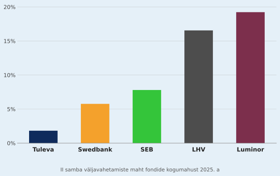
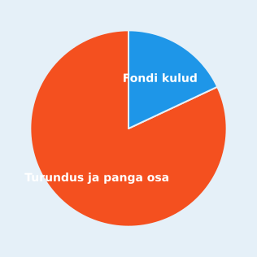
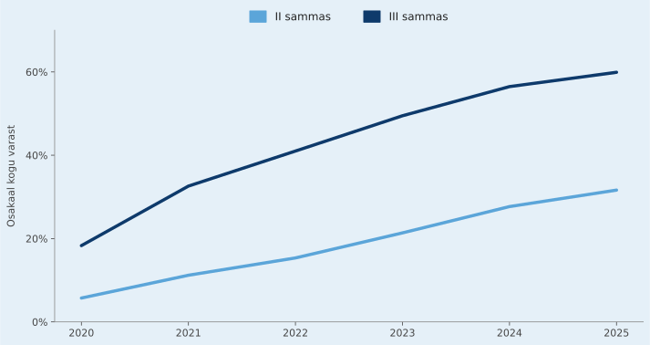

# Mida räägivad meile fondivalitsejate 2025. aasta aruanded?

*Kui Tulevaga alustasime, panime tähele, et pankade kõrged tasud ei läinud mitte suure investeerimismeeskonna tasudeks vaid müügiks ja emaettevõtte kasumiks. Kuigi pensionifondide tasud on viimase 10 aastaga tublisti langenud, näitavad ka 2025. aasta aruanded, et ka täna läheb enamus kõrgest tasust sinna. Paradoksaalne on seejuures, et hoolimata kõrgetest müügikuludest, pankade vanade pensionifondide maht ei kasva.*

##### Miks pankade fondiäri ei kasva?

*Allikas: Pensionikeskus.ee, Tuleva analüüs. „Churn" = aasta jooksul fondist välja vahetatud raha osakaal aasta algse fondimahu suhtes.*

Pilt räägib selgelt: pankade vanad, kõrge tasuga pensionifondid kaotavad raha kordades kiiremini kui Tuleva. 2025. aastal lahkus LHV vanadest pensionifondidest **16,6%** mahust ja Luminori vanadest fondidest **19,2%** mahust. Tulevast lahkus võrdluseks **1,8%**.

Müügiedetabeli eesotsas on ikka pankade vanad, kõrge tasuga fondid. Aga nende vanade fondide maht ei kasva, sest sealt lahkub raha kordades rohkem kui sisse tuleb. See on ka põhjus, miks Tuleva on jätkuvalt kõige kiiremini kasvav fondivalitseja, kuigi müügiedetabelites oleme pigem tagaotsas. Meil lihtsalt pole neid vanu, kallite tasudega fonde, kust kogujad kümnete miljonite eurode eest raha välja viivad.

> Kõrge tasu tuleb suurtest kuludest. Selle maksab kinni koguja.

See kõik maksab palju raha, mille peavad kinni maksma ikka kogujad kõrge valitsemistasu arvelt. 2025. aastal kulutasid neli panga fondivalitsejat (Swedbank, LHV, SEB ja Luminor) kokku **29,2 miljonit eurot** halduskuludeks. See on **0,49% nende II ja III samba varade mahust aastas**. Tulevas oleme hakkama saanud sellega **0,23%-ga** — ehk **kaks kuni kolm korda madalamate kuludega**.

Kogukulud suhtena fondide vara mahtu (II + III sammas, 2025):

| Fondivalitseja | Kogukulud (mln €) | Keskmine AUM (mln €) | Kulu / AUM |
|---|---:|---:|---:|
| Luminor | 3,52 | 530 | **0,66%** |
| SEB | 5,80 | 1 112 | 0,52% |
| Swedbank | 13,31 | 2 755 | 0,48% |
| LHV | 6,54 | 1 532 | 0,43% |
| **Pangad kokku** | **29,17** | **5 929** | **0,49%** |
| Tuleva (võrdluseks) | 2,71 | 1 174 | **0,23%** |

##### Kuhu kulub pensionifondide teenustasu?

Küsisime seda küsimust juba [8 aastat tagasi](/?p=16506), kui Tuleva alustas. Pangad väitsid, et madalama tasuga ei saa pensionifonde teha. Meie näitasime, et saame. Tuleb lihtsalt raha kulutada ainult neile tegevustele, mis kogujatele väärtust loovad.

Tänagi maksavad pankade pensionifondides kogujad raha teenuse eest, mida nad ei vaja. Pangad teenisid 2025. aastal Eesti II ja III samba pensionifondidest **50,7 miljonit eurot** valitsemistasu tulu. Sellest läks **ainult 18% (9 miljonit €) fondi tegelikuks haldamiseks** — investeerimistiimi palkadeks, IT-le, depootasudele ja muudeks tegevuskuludeks. **Ülejäänud 82% (42 miljonit €) kulus müügile, turundusele, emaettevõtte vahendustasudele ja jäi pankade kasumiks**.

Ehk **igast 100 eurost, mille koguja maksab teenustasuna pankade pensionifondile, läheb ainult ~18 eurot fondi tegelikuks haldamiseks**. Ülejäänud ~82 eurot kulub müügile ja kasumiks — tegevustele, mis kogujale väärtust ei loo.

*[Vaata detailsemat analüüsi koos viidetega aruannetele.](https://tulevaee.github.io/reporting-engine/fund_manager_expenses.html)*

##### Mida see kogujatele tähendab?

Kogujad hääletavad jalgadega ning järjest suurem osa ei ole nõus enam pankade kõrgeid kulusid kinni maksma. Seepärast kasvab indeksifondide maht nii teises kui kolmandas sambas kiiresti. Täpselt nii nagu mujalgi maailmas.

*Allikas: Pensionikeskus.ee. „Indeksifondid" = passiivselt juhitud fondid (nimes „Indeks" / „Index" + Tuleva fondid).*

**II sambas** moodustasid indeksifondid 2020. aastal **6%** turuosast. 2025. aasta lõpu seisuga juba **32%** – peaaegu iga kolmas euro II sambas on madala tasuga indeksifondis. **III sambas** on osakaal kasvanud **18%-lt 60%-le** – enamus III samba rahast on tänaseks madala tasuga indeksifondis.

Fondivalitsemine on mahuäri – mida rohkem inimesi sinu fondides kogub, seda suurem on fondi maht ja seda madalama tasuga saab fondi hallata. Indeksifondides tähendab see kogujale, et tasud langevad pidevalt. Täna saab koguja valida lisaks Tulevale ka pankade indeksifondide valikust nii II kui III sambas, kus jooksvad tasud on **alla 0,3% aastas**.

Paraku pankade vanades pensionifondides see matemaatika ei tööta: nende tasud ei lange, sest kogujate lisamine on kallis ning enamus kallilt lisatud kogujaid läheb esimesel võimalusel jälle minema. Nii ei ole vanade pensionifondide tasud langenud hoolimata sellest, et igal aastal meelitavad müügimehed kümneid tuhandeid inimesi fondi vahetama.

Täna ei ole kogujal mingit põhjust hoida oma teise või kolmanda samba vara fondis, mis võtab jooksvateks tasudeks rohkem kui **0,3% aastas**. [Sellega toetad ainult müügimeeste armee ülalpidamist](/?p=17020). Mida kõrgemad tasud, seda suurem tõenäosus, et fondi tulemused jäävad pika aja jooksul maailma keskmisele alla.

Seda, kui palju sinu fond tasu võtab, näed Pensionikeskuse lehel või veelgi lihtsamalt [Tuleva lehel oma kontole sisse logides](https://pension.tuleva.ee/login).

---

*(1) Detailset analüüsi koos viidetega aruannetele [vaata siit](https://tulevaee.github.io/reporting-engine/fund_manager_expenses.html).*
*(2) [Pensionifondide müügistatistika leiad Pensionikeskuse lehelt.](https://www.pensionikeskus.ee/statistika/ii-sammas/kogumispensioni-fondide-pik-vahetus/)*
*(3) [Pensionifondide jooksvad tasud leiad Pensionikeskuse lehelt.](https://www.pensionikeskus.ee/ii-sammas/kohustuslikud-pensionifondid/jooksvate-tasude-vordlus/)*
*(4) [Morningstar Inc. Fund fees predict future success or failure](https://www.morningstar.com/articles/752485/fund-fees-predict-future-success-or-failure).*

---

## Kuluartiklid 2025

Allikas: `tuleva-reports/reports/adhoc/fund_manager_expenses.ipynb`. Summad € tuhandetes.

| Fondivalitseja | Depootasu | Tööjõukulud | Muud halduskulud | Põhivara amort | Kapitaliseeritud kulud | Korrigeeritud kulud kokku |
|---|---:|---:|---:|---:|---:|---:|
| Swedbank | 1 476 | 1 308 | 10 526 | 0 | 0 | **13 309** |
| LHV | 587 | 2 644 | 2 888 | 1 248 | 422 | **6 543** |
| SEB | 509 | 897 | 4 398 | 11 | 0 | **5 804** |
| Luminor | 304 | 645 | 683 | 1 878 | 1 886 | **3 518** |
| **Pangad kokku** | **2 876** | **5 494** | **18 495** | **3 137** | **2 308** | **29 174** |
| Tuleva | 210 | 909 | 1 343 | 63 | 252 | **2 714** |

*Arvestusmeetodi ühtlustamiseks võtsime kulude summast välja amortisatsiooni ja lisasime aasta jooksul kapitaliseeritud kulud.*
