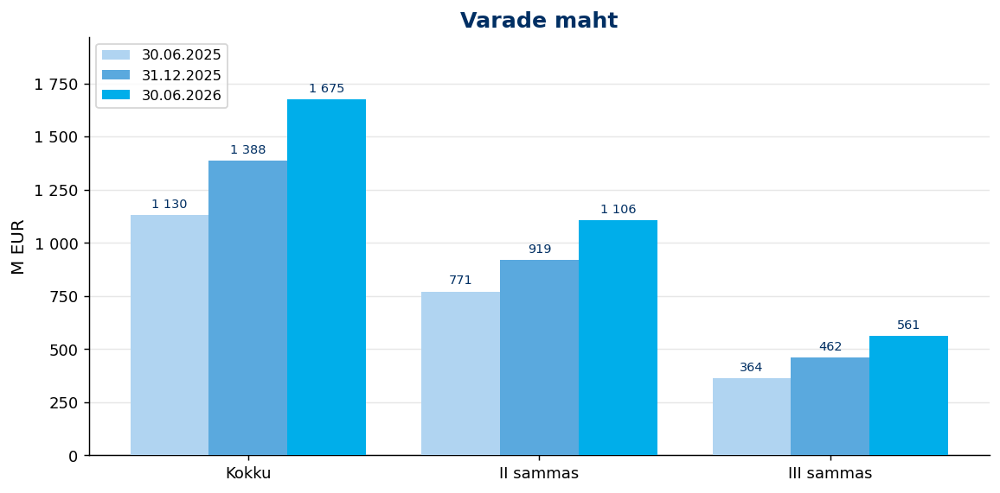
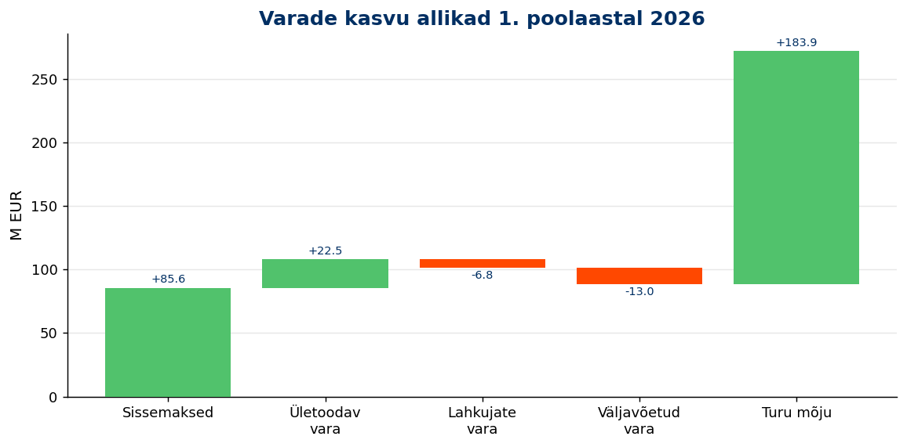
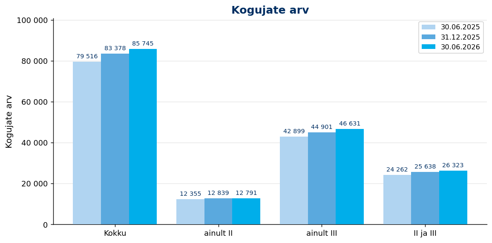
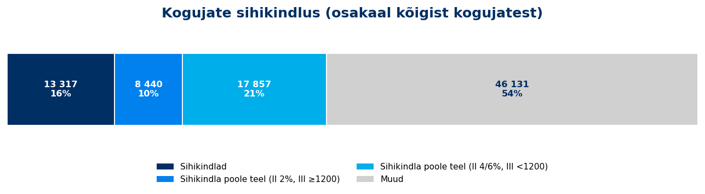
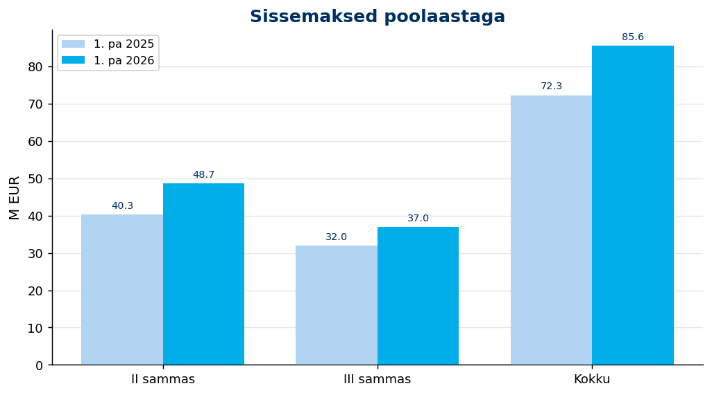

# Tuleva 2026. aasta esimese poolaasta tulemused

*Võrdlus: 1. poolaasta 2026 vs 1. poolaasta 2025. Andmed seisuga 30.06.2026.*

---

## Varade maht ja kasv

<!-- comment:aum -->

<!-- /comment:aum -->

| Vara | 30.06.2025 | 31.12.2025 | 30.06.2026 | Poolaastaga | Aastaga |
|---|:---:|:---:|:---:|:---:|:---:|
| Varade maht kokku | 1 130 M EUR | 1 388 M EUR | 1 675 M EUR | *+20.7%* | *+48.2%* |
| sh II sammas | 771 M EUR | 919 M EUR | 1 106 M EUR | *+20.4%* | *+43.5%* |
| sh III sammas | 364 M EUR | 462 M EUR | 561 M EUR | *+21.5%* | *+54.0%* |

<!-- comment:growth -->

<!-- /comment:growth -->

| Kasvuallikas | 1. poolaasta 2026 | 1. poolaasta 2025 |
|---|:---:|:---:|
| Sissemaksed | 85.6 M EUR | 72.3 M EUR |
| Vahetustega ületoodud vara | 22.5 M EUR | 28.2 M EUR |
| Lahkujate vara | -6.8 M EUR | -6.0 M EUR |
| Väljavõetud vara | -13.0 M EUR | -12.2 M EUR |
| Turu mõju | 183.9 M EUR | -35.9 M EUR |

---

## Kogujad

<!-- comment:savers -->

<!-- /comment:savers -->

| Kogujad | 30.06.2025 | 31.12.2025 | 30.06.2026 | Poolaastaga | Aastaga |
|---|:---:|:---:|:---:|:---:|:---:|
| Kogujaid kokku | 79 516 | 83 378 | 85 745 | *+2.8%* | *+7.8%* |
| sh ainult II sammas | 12 355 | 12 839 | 12 791 | *−0.4%* | *+3.5%* |
| sh ainult III sammas | 42 899 | 44 901 | 46 631 | *+3.9%* | *+8.7%* |
| sh II ja III sammas | 24 262 | 25 638 | 26 323 | *+2.7%* | *+8.5%* |

### Uued kogujad

<!-- comment:new_savers -->

<!-- /comment:new_savers -->

| Uued kogujad | 1. poolaasta 2026 | 1. poolaasta 2025 | Muutus |
|---|:---:|:---:|:---:|
| Uusi kogujaid kokku | 3 425 | 3 636 | *−5.8%* |
| sh uued II samba kogujad | 1 880 | 2 255 | *−16.6%* |
| sh uued III samba kogujad | 3 115 | 3 102 | *+0.4%* |

### Kui sihikindlad on meie kogujad?

<!-- comment:determination -->

<!-- /comment:determination -->

| Grupp | Kogujaid | Osakaal |
|---|:---:|:---:|
| **Sihikindlad** (II 4/6% ja III ≥ 1200 €) | 13 317 | 15.5% |
| **Sihikindla poole teel** | 26 297 | 30.7% |
| &nbsp;&nbsp;– II 4/6%, aga III < 1200 € | 17 857 | 20.8% |
| &nbsp;&nbsp;– II 2%, aga III ≥ 1200 € | 8 440 | 9.8% |
| Muud | 46 131 | 53.8% |
| **Kogujaid kokku** | **85 745** | **100,0%** |

*Hetkeseis. Segment (card 2324): II samba maksemäär × III samba viimase 12 kuu sissemaksed. Baas on aktiivsete kogujate arv (card 2578), sama mis ülal — "Muud" on jääk.*

---

## Sissemaksed

<!-- comment:contributions -->

<!-- /comment:contributions -->

| Sissemaksed | 1. poolaasta 2026 | 1. poolaasta 2025 | Muutus |
|---|:---:|:---:|:---:|
| II samba sissemaksed | 48.7 M EUR | 40.3 M EUR | *+20.8%* |
| III samba sissemaksed | 37.0 M EUR | 32.0 M EUR | *+15.5%* |
| **Sissemaksed kokku** | **85.6 M EUR** | **72.3 M EUR** | ***+18.4%*** |

### Täiendavasse Kogumisfondi tehtud maksed

| TKF | 1. poolaasta 2026 | 1. poolaasta 2025 | Muutus |
|---|:---:|:---:|:---:|
| Sissemaksed kokku | 11.3 M EUR | – (fond ei tegutsenud) | *–* |

---

## Fondivahetused

<!-- comment:switching -->

<!-- /comment:switching -->

| Fondivahetused | 1. poolaasta 2026 | 1. poolaasta 2025 | Muutus |
|---|:---:|:---:|:---:|
| Tulevasse vahetanute arv (II sammas) | 1 567 | 2 189 | *−28.4%* |
| sh ületoodud vara | 22.5 M EUR | 28.2 M EUR | *−20.1%* |
| Tulevast välja vahetanute arv (II sammas) | 556 | 646 | *−13.9%* |
| Tulevast välja vahetanute arv (III sammas) | 298 | 264 | *+12.9%* |

---

## Väljavoolud

<!-- comment:outflows -->

<!-- /comment:outflows -->

| Väljavoolud | 1. poolaasta 2026 | 1. poolaasta 2025 | Muutus |
|---|:---:|:---:|:---:|
| II sambast raha välja võtnute arv | 387 | 407 | *−4.9%* |
| II sambast välja võetud vara | 7.2 M EUR | 7.8 M EUR | *−7.3%* |
| III sambast raha välja võtnute arv | 2 521 | 2 137 | *+18.0%* |
| III sambast välja võetud vara | 5.8 M EUR | 4.4 M EUR | *+31.5%* |
| II samba lahkujate (teise fondi vahetanute) vara | 6.8 M EUR | 6.0 M EUR | *+13.2%* |

---

*Aruanne genereeritud [Tuleva Reporting Engine](https://github.com/TulevaEE/reporting-engine)'iga*
