# Tuleva igakuine juhatuse aruanne

**Märts 2026**

*Aruande kuupäev: 2026-04-07*

---

## 1. Varade maht ja kasv

<!-- comment:aum -->

<!-- /comment:aum -->

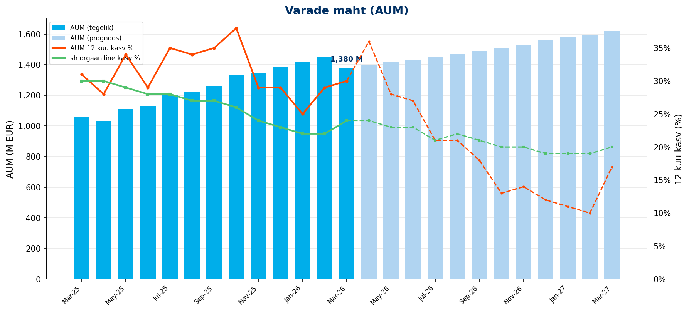

| KPI | Märts 2026 |
|---------|:---:|
| AUM kuu lõpus | 1380 M EUR |
| AUM 12 kuu kasv | 30% |
| sh sissemaksetest ja vahetustest | 24% |

<!-- comment:aum_waterfall -->

<!-- /comment:aum_waterfall -->

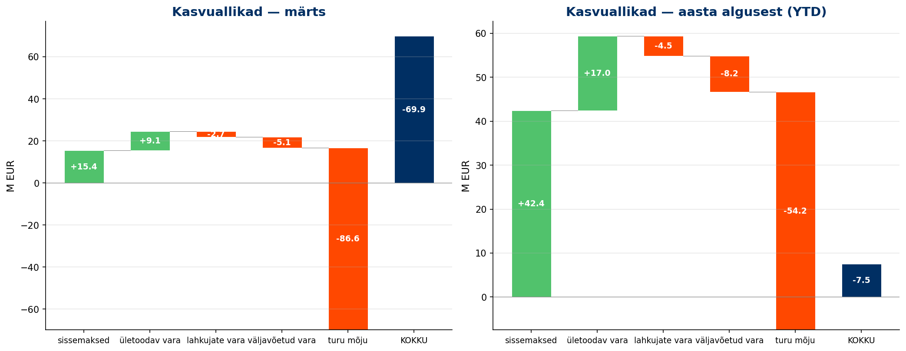

---

## 2. Uued kogujad

<!-- comment:savers -->

<!-- /comment:savers -->

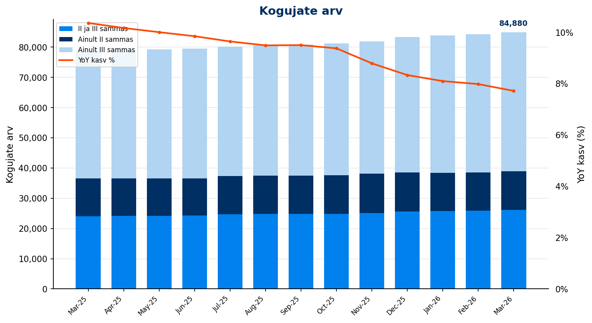

| KPI | Märts 2026 |
|---------|:---:|
| Kogujate arv | 84,880 |
| sh ainult II sammas | 12,846 |
| sh ainult III sammas | 45,883 |
| sh II ja III sammas | 26,151 |
| YoY kasv | *7.7%* |

### Uued kogujad

<!-- comment:new_savers -->

<!-- /comment:new_savers -->

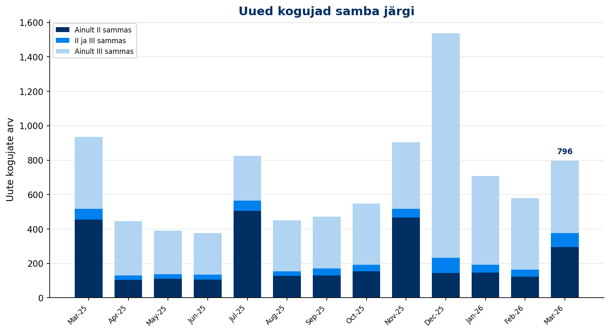

| KPI | Märts 2026 | YTD |
|---------|:---:|:---:|
| Uued kogujad | 796 | 2,084 |
| YoY muutus | *-15.0%* | |
| sh uued II samba kogujad | 648 | 1,242 |
| sh uued III samba kogujad | 602 | 1,855 |

---

## 3. Sissemaksed

<!-- comment:contributions -->

<!-- /comment:contributions -->

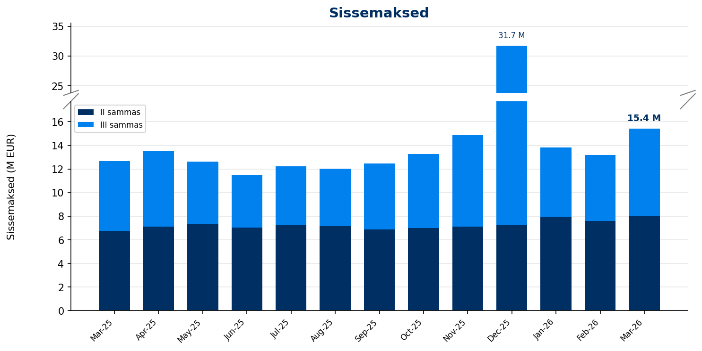

| KPI | Märts 2026 | YoY | YTD | YoY |
|---------|:---:|:---:|:---:|:---:|
| II samba sissemaksed | 8.0 M EUR | *18.8%* | 23.6 M EUR | *25.5%* |
| III samba sissemaksed | 7.4 M EUR | *24.9%* | 18.8 M EUR | *19.0%* |
| **Sissemaksed kokku** | **15.4 M EUR** | ***21.6%*** | **42.4 M EUR** | ***22.5%*** |

<!-- comment:iii_contributions -->

<!-- /comment:iii_contributions -->

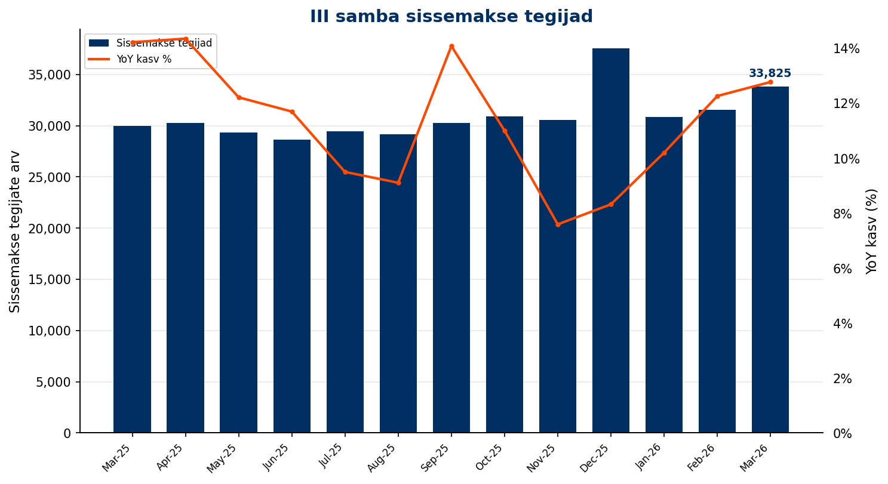

### III samba sissemakse tegijad

| KPI | Märts 2026 | YoY | YTD |
|---------|:---:|:---:|:---:|
| Sissemakse tegijate arv | 33,825 | *12.8%* | 36,409 |
| Püsimakse tegijate osakaal | 70.0% | | |

### II samba maksemäära muutmine

| KPI | Märts 2026 | YoY | YTD | YoY |
|---------|:---:|:---:|:---:|:---:|
| Maksemäära tõstnud | 213 | *12.7%* | 548 | *5.8%* |
| Maksemäära langetanud | 27 | *-37.2%* | 109 | *-37.4%* |

### Täiendavasse Kogumisfondi tehtud maksed

| KPI | Märts 2026 | YTD |
|---------|:---:|:---:|
| Sissemaksete summa | 0.6 M EUR | 7.5 M EUR |
| Sissemakse tegijate arv | 454 | |

---

## 4. Fondivahetused

<!-- comment:switching -->

<!-- /comment:switching -->

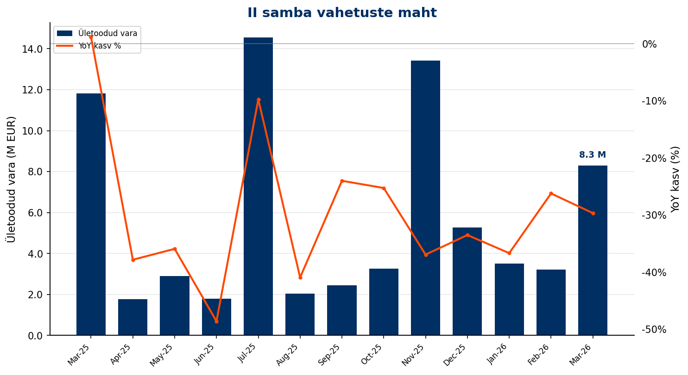

| KPI | Märts 2026 | YoY | YTD | YoY |
|---------|:---:|:---:|:---:|:---:|
| Sissevahetajate arv | 570 | *-33.4%* | 1,053 | *-34.4%* |
| Ületoodud vara | 8.3 M EUR | *-29.7%* | 15.0 M EUR | *-30.9%* |

<!-- comment:switching_conversion -->

<!-- /comment:switching_conversion -->

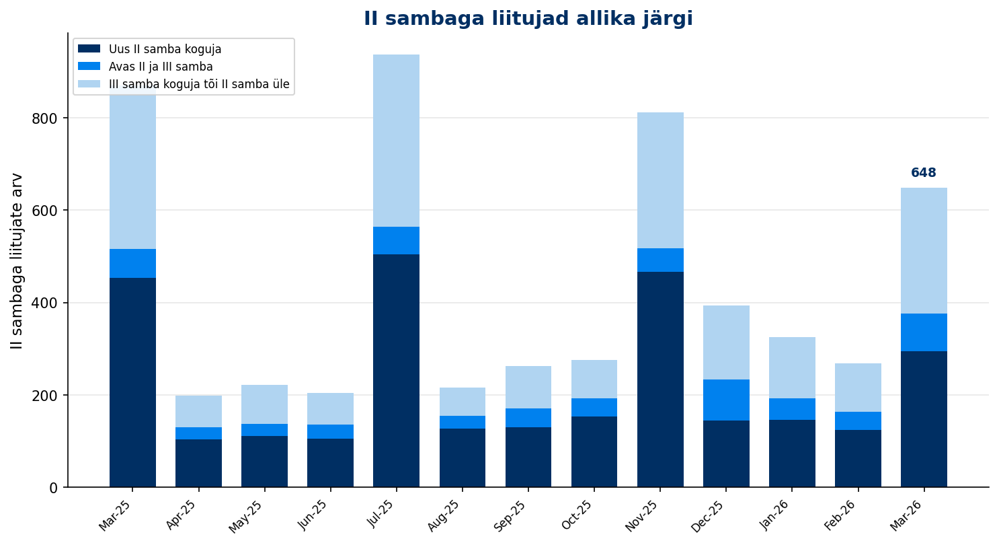

<!-- comment:switching_sources -->

<!-- /comment:switching_sources -->

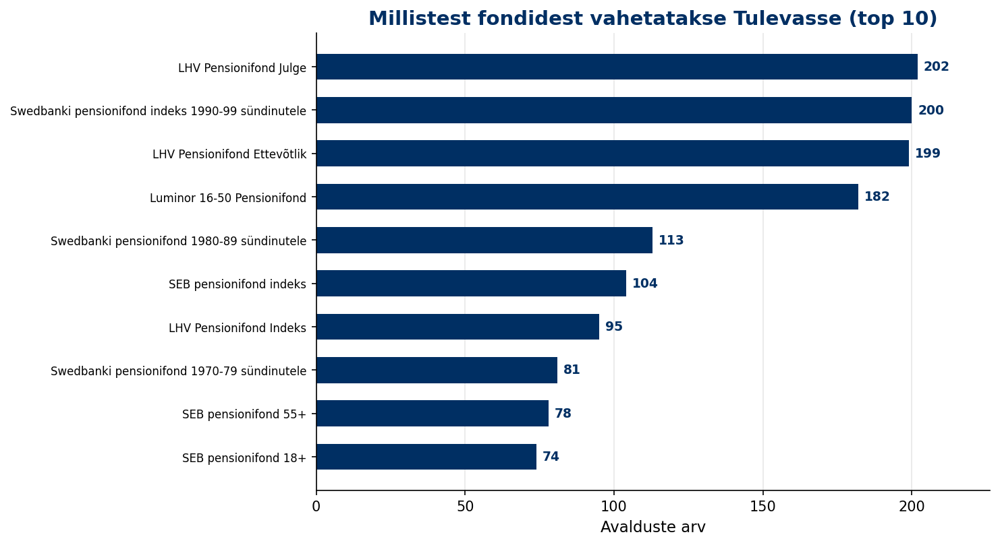

---

## 5. Väljavoolud

<!-- comment:outflows -->

<!-- /comment:outflows -->

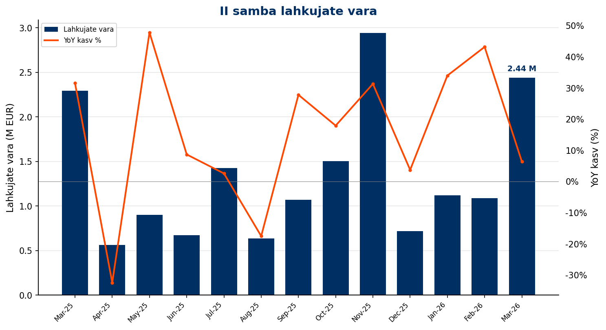

<!-- comment:drawdowns -->

<!-- /comment:drawdowns -->

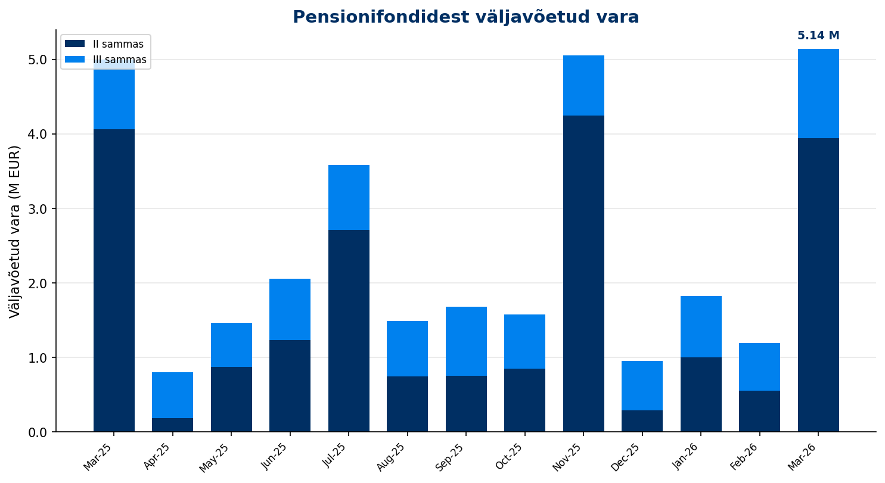

| KPI | Märts 2026 | YoY | YTD |
|---------|:---:|:---:|:---:|
| II samba lahkujate vara | 2.4 M EUR | *6.4%* | 4.7 M EUR |
| II samba väljujate vara | 3.9 M EUR | *-3.0%* | 5.5 M EUR |
| III sambast väljavõetud vara | 1.2 M EUR | *28.7%* | 2.7 M EUR |

---

## 6. Osakuhinna muutus

<!-- comment:unit_price -->

<!-- /comment:unit_price -->

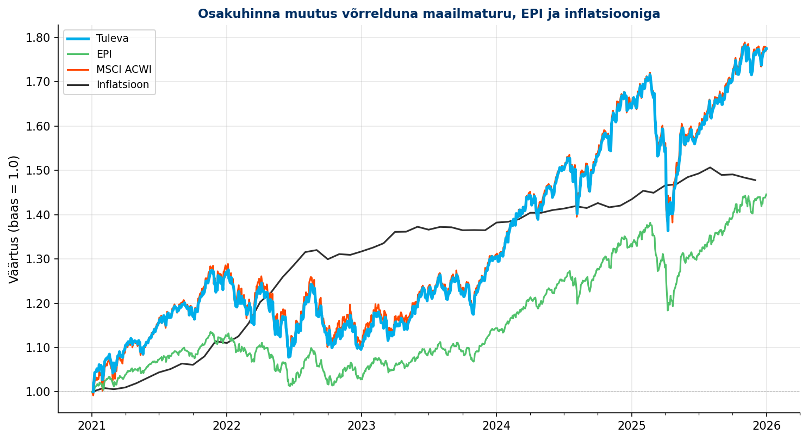

<!-- comment:cumulative_returns -->

<!-- /comment:cumulative_returns -->

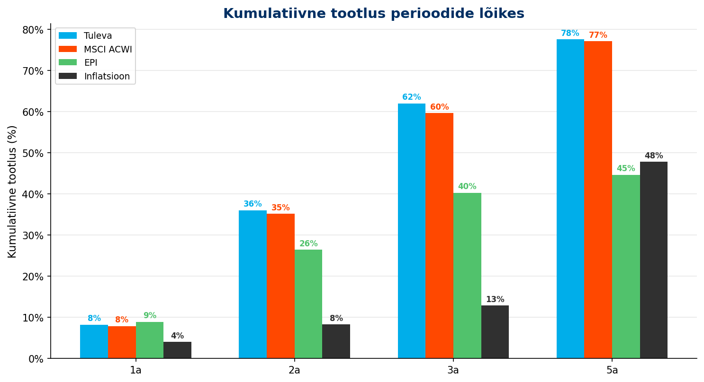

---

---

*Aruanne genereeritud [Tuleva Reporting Engine](https://github.com/TulevaEE/reporting-engine)'iga*