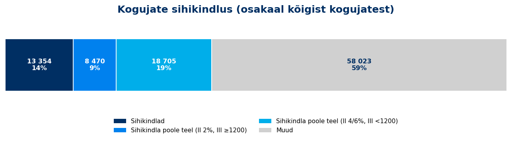

# Tuleva igakuine juhatuse aruanne

**Juuni 2026**

*Aruande kuupäev: 2026-07-14*

---

## 1. Varade maht ja kasv

<!-- comment:aum -->

<!-- /comment:aum -->

| KPI | Juuni 2026 |
|---------|:---:|
| AUM kuu lõpus | 1675 M EUR |
| AUM 12 kuu kasv | 48% |
| sh sissemaksetest ja vahetustest | 23% |

<!-- comment:aum_waterfall -->

<!-- /comment:aum_waterfall -->

---

## 2. Uued kogujad

<!-- comment:savers -->

<!-- /comment:savers -->

| KPI | Juuni 2026 |
|---------|:---:|
| Kogujate arv | 85,745 |
| sh ainult II sammas | 12,791 |
| sh ainult III sammas | 46,631 |
| sh II ja III sammas | 26,323 |
| YoY kasv | *7.8%* |

### Uued kogujad

<!-- comment:new_savers -->

<!-- /comment:new_savers -->

| KPI | Juuni 2026 | YTD |
|---------|:---:|:---:|
| Uued kogujad | 407 | 3,425 |
| YoY muutus | *8.2%* | |
| sh uued II samba kogujad | 204 | 1,880 |
| sh uued III samba kogujad | 384 | 3,115 |

### Kui sihikindlad on meie kogujad?

<!-- comment:determination -->

<!-- /comment:determination -->

| Grupp | 31.12.2025 | 30.06.2026 | Muutus |
|---|:---:|:---:|:---:|
| **Sihikindlad** (II 4/6% ja III ≥ 1200 €) | 12,796 (15,3%) | 13,354 (13,6%) | +558 (−1,8 pp) |
| **Sihikindla poole teel** | 15,558 (18,7%) | 27,175 (27,6%) | +11,617 (+8,9 pp) |
| &nbsp;&nbsp;– II 4/6%, aga III < 1200 € | 9,781 (11,7%) | 18,705 (19,0%) | +8,924 (+7,2 pp) |
| &nbsp;&nbsp;– II 2%, aga III ≥ 1200 € | 5,777 (6,9%) | 8,470 (8,6%) | +2,693 (+1,7 pp) |
| Muud | 55,024 (66,0%) | 58,023 (58,9%) | +2,999 (−7,1 pp) |
| **Kogujaid kokku** | **83,378** | **98,552** | **+15,174** |

*Võrdlus 2025. aasta aruande hetkeseisuga (card 2324): II samba maksemäär × III samba viimase 12 kuu sissemaksed. Baas hõlmab kõiki kogujaid, sh neid, kellel pole aktiivset sissemakset. Osakaal on arvestatud vastava kuupäeva kogubaasist.*

---

## 3. Sissemaksed

<!-- comment:contributions -->

<!-- /comment:contributions -->

| KPI | Juuni 2026 | YoY | YTD | YoY |
|---------|:---:|:---:|:---:|:---:|
| II samba sissemaksed | 8.1 M EUR | *15.0%* | 48.7 M EUR | *20.8%* |
| III samba sissemaksed | 6.0 M EUR | *34.4%* | 37.0 M EUR | *15.6%* |
| **Sissemaksed kokku** | **14.1 M EUR** | ***22.6%*** | **85.7 M EUR** | ***18.5%*** |

<!-- comment:iii_contributions -->

<!-- /comment:iii_contributions -->

### III samba sissemakse tegijad

| KPI | Juuni 2026 | YoY | YTD |
|---------|:---:|:---:|:---:|
| Sissemakse tegijate arv | 33,619 | *17.3%* | 40,066 |
| Püsimakse tegijate osakaal | 75.0% | | |

### II samba maksemäära muutmine

| KPI | Juuni 2026 | YoY | Alates detsembrist | YoY |
|---------|:---:|:---:|:---:|:---:|
| Maksemäära tõstnud | 108 | *18.7%* | 893 | *-15.4%* |
| Maksemäära langetanud | 28 | *-45.1%* | 176 | *-53.1%* |

### Täiendavasse Kogumisfondi tehtud maksed

| KPI | Juuni 2026 | YTD |
|---------|:---:|:---:|
| Sissemaksete summa | 2.0 M EUR | 11.3 M EUR |
| Sissemakse tegijate arv | 672 | |

---

## 4. Fondivahetused

<!-- comment:switching -->

<!-- /comment:switching -->

| KPI | Juuni 2026 | YoY | YTD | YoY |
|---------|:---:|:---:|:---:|:---:|
| Sissevahetajate arv | 154 | *-13.5%* | 1,567 | *-28.4%* |
| Ületoodud vara | 2.3 M EUR | *25.4%* | 22.5 M EUR | *-20.2%* |

<!-- comment:switching_conversion -->

<!-- /comment:switching_conversion -->

<!-- comment:switching_sources -->

<!-- /comment:switching_sources -->

---

## 5. Väljavoolud

<!-- comment:outflows -->

<!-- /comment:outflows -->

<!-- comment:drawdowns -->

<!-- /comment:drawdowns -->

| KPI | Juuni 2026 | YoY | YTD |
|---------|:---:|:---:|:---:|
| II samba lahkujate vara | 0.4 M EUR | *-47.0%* | 6.8 M EUR |
| II samba väljujate vara | 0.7 M EUR | *-42.4%* | 7.2 M EUR |
| III sambast väljavõetud vara | 1.1 M EUR | *30.0%* | 5.8 M EUR |

---

## 6. Osakuhinna muutus

<!-- comment:unit_price -->

<!-- /comment:unit_price -->

<!-- comment:cumulative_returns -->

<!-- /comment:cumulative_returns -->

---

## 7. Tuleva finantstulemused

<!-- comment:financials -->

<!-- /comment:financials -->

| KPI | Juuni 2026 | YoY |
|---------|:---:|:---:|
| Brutomarginaal pärast litsentsitasu | 127,764 EUR | *-3%* |
| Tööjõukulud | -80,032 EUR | *-12%* |
| Mitmesugused tegevuskulud | -18,685 EUR | *12%* |
| Ebitda/ärikasum | 29,046 EUR | *20%* |
| Puhaskasum | 23,365 EUR | *20%* |
| **Litsentsitasu ühistule** | **60,419 EUR** | ***28%*** |

---

*Aruanne genereeritud [Tuleva Reporting Engine](https://github.com/TulevaEE/reporting-engine)'iga*