# Tuleva igakuine juhatuse aruanne

**Juuli 2026**

*Aruande kuupäev: 2026-08-04*

---

## 1. Varade maht ja kasv

<!-- comment:aum -->

<!-- /comment:aum -->

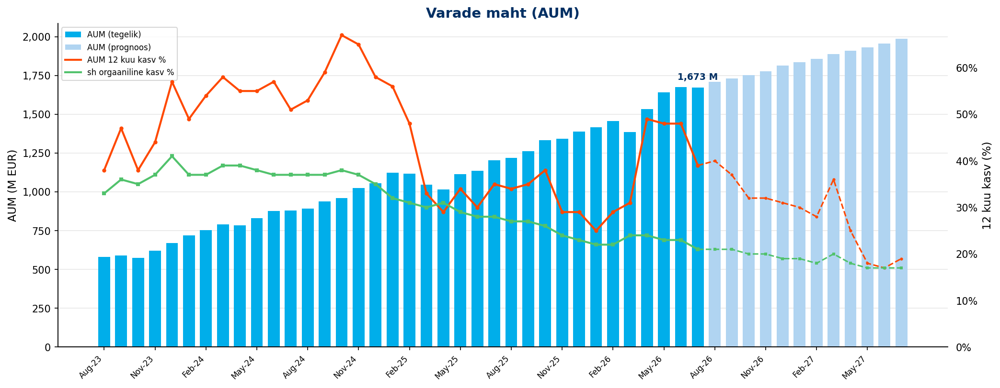

| KPI | Juuli 2026 |
|---------|:---:|
| AUM kuu lõpus | 1673 M EUR |
| AUM 12 kuu kasv | 39% |
| sh sissemaksetest ja vahetustest | 21% |

<!-- comment:aum_waterfall -->

<!-- /comment:aum_waterfall -->

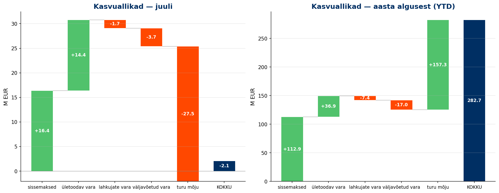

---

## 2. Uued kogujad

<!-- comment:savers -->

<!-- /comment:savers -->

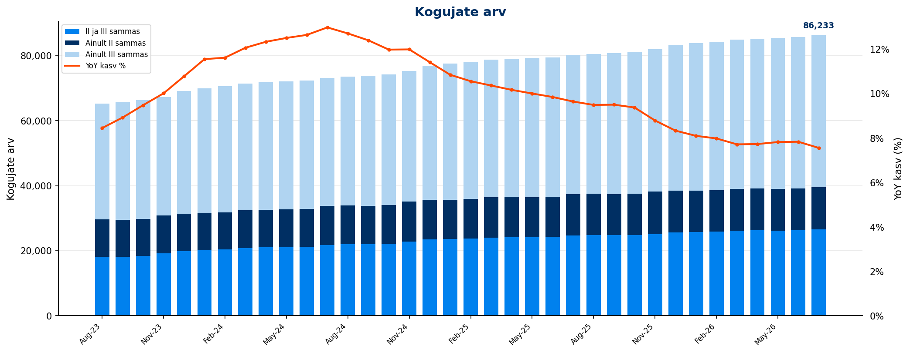

| KPI | Juuli 2026 |
|---------|:---:|
| Kogujate arv | 86,233 |
| sh ainult II sammas | 12,993 |
| sh ainult III sammas | 46,631 |
| sh II ja III sammas | 26,609 |
| YoY kasv | *7.6%* |

### Uued kogujad

<!-- comment:new_savers -->

<!-- /comment:new_savers -->

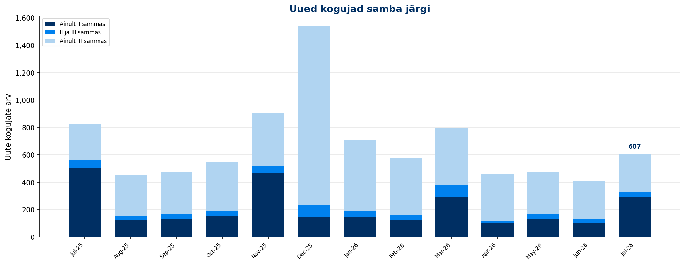

| KPI | Juuli 2026 | YTD |
|---------|:---:|:---:|
| Uued kogujad | 607 | 4,032 |
| YoY muutus | *-26.5%* | |
| sh uued II samba kogujad | 616 | 2,496 |
| sh uued III samba kogujad | 390 | 3,505 |

### Kui sihikindlad on meie kogujad?

<!-- comment:determination -->

<!-- /comment:determination -->

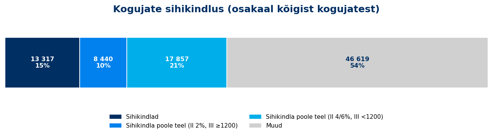

| Grupp | Kogujaid | Osakaal |
|---------|:---:|:---:|
| **Sihikindlad** (II 4/6% ja III ≥ 1200 €) | 13,317 | 15.4% |
| **Sihikindla poole teel** | 26,297 | 30.5% |
| &nbsp;&nbsp;– II 4/6%, aga III < 1200 € | 17,857 | 20.7% |
| &nbsp;&nbsp;– II 2%, aga III ≥ 1200 € | 8,440 | 9.8% |
| Muud | 46,619 | 54.1% |
| **Kogujaid kokku** | **86,233** | **100,0%** |

*Hetkeseis. Segment (card 2324): II samba maksemäär × III samba viimase 12 kuu sissemaksed. Baas on aktiivsete kogujate arv (card 2578), sama mis tabelis 2 — "Muud" on jääk.*

---

## 3. Sissemaksed

<!-- comment:contributions -->

<!-- /comment:contributions -->

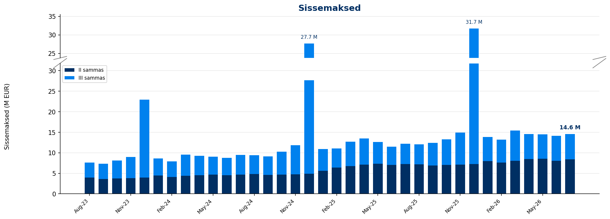

| KPI | Juuli 2026 | YoY | YTD | YoY |
|---------|:---:|:---:|:---:|:---:|
| II samba sissemaksed | 8.4 M EUR | *16.0%* | 57.1 M EUR | *20.2%* |
| III samba sissemaksed | 6.2 M EUR | *23.6%* | 43.1 M EUR | *16.5%* |
| **Sissemaksed kokku** | **14.6 M EUR** | ***19.1%*** | **100.2 M EUR** | ***18.6%*** |

<!-- comment:iii_contributions -->

<!-- /comment:iii_contributions -->

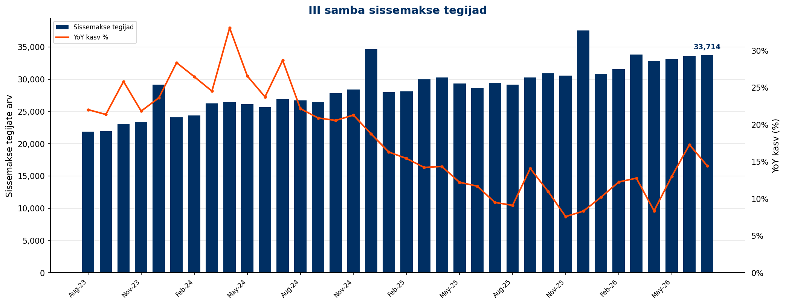

### III samba sissemakse tegijad

| KPI | Juuli 2026 | YoY | YTD |
|---------|:---:|:---:|:---:|
| Sissemakse tegijate arv | 33,714 | *14.5%* | 40,543 |
| Püsimakse tegijate osakaal | 77.5% | | |

### II samba maksemäära muutmine

| KPI | Juuli 2026 | YoY | Alates detsembrist | YoY |
|---------|:---:|:---:|:---:|:---:|
| Maksemäära tõstnud | 325 | *-2.1%* | 1,218 | *-12.2%* |
| Maksemäära langetanud | 20 | *-70.1%* | 196 | *-55.7%* |

### Täiendavasse Kogumisfondi tehtud maksed

| KPI | Juuli 2026 | YTD |
|---------|:---:|:---:|
| Sissemaksete summa | 1.9 M EUR | 13.2 M EUR |
| Sissemakse tegijate arv | 839 | |

---

## 4. Fondivahetused

<!-- comment:switching -->

<!-- /comment:switching -->

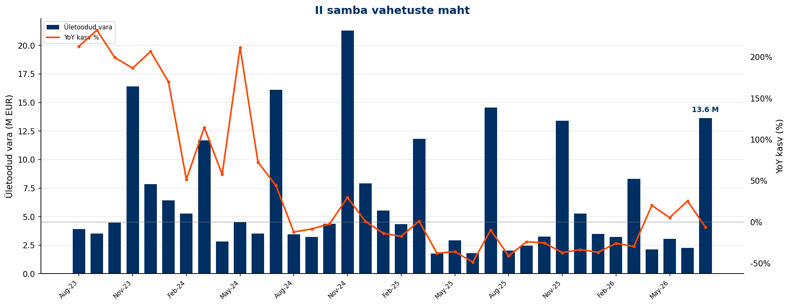

| KPI | Juuli 2026 | YoY | YTD | YoY |
|---------|:---:|:---:|:---:|:---:|
| Sissevahetajate arv | 649 | *-31.6%* | 2,216 | *-29.4%* |
| Ületoodud vara | 13.6 M EUR | *-6.4%* | 36.1 M EUR | *-15.5%* |

<!-- comment:switching_conversion -->

<!-- /comment:switching_conversion -->

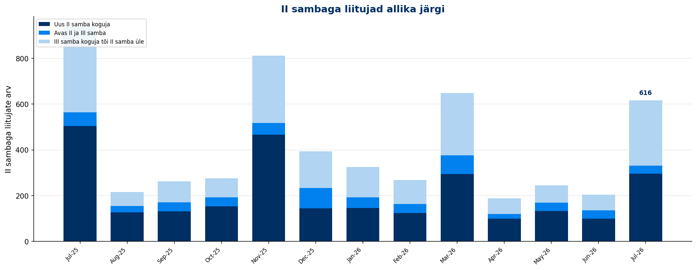

<!-- comment:switching_sources -->

<!-- /comment:switching_sources -->

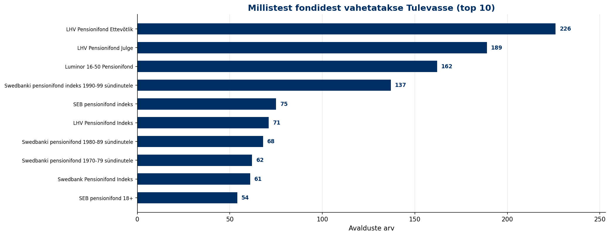

---

## 5. Väljavoolud

<!-- comment:outflows -->

<!-- /comment:outflows -->

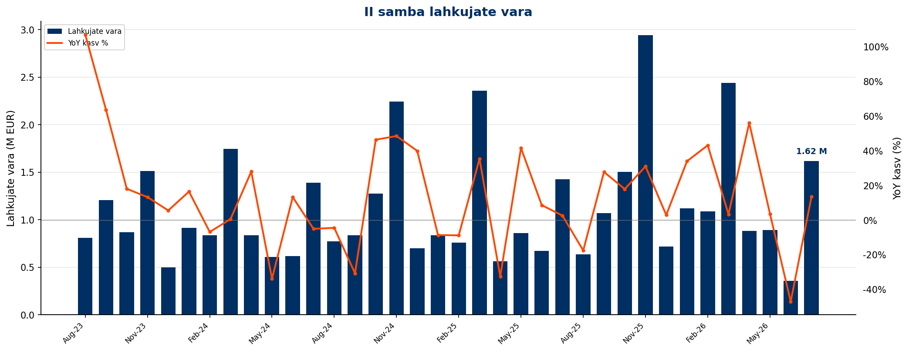

<!-- comment:drawdowns -->

<!-- /comment:drawdowns -->

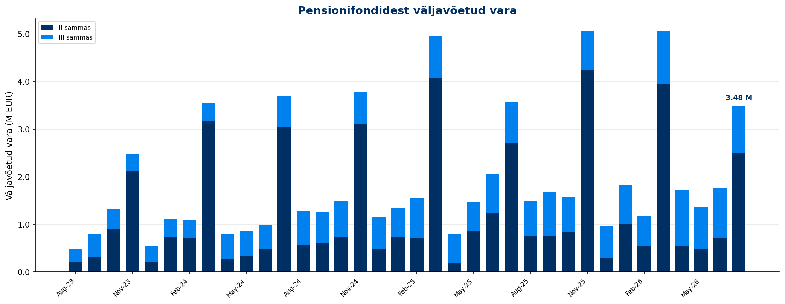

| KPI | Juuli 2026 | YoY | YTD |
|---------|:---:|:---:|:---:|
| II samba lahkujate vara | 1.6 M EUR | *13.5%* | 8.4 M EUR |
| II samba väljujate vara | 2.5 M EUR | *-7.5%* | 9.7 M EUR |
| III sambast väljavõetud vara | 1.0 M EUR | *12.5%* | 6.7 M EUR |

---

## 6. Osakuhinna muutus

<!-- comment:unit_price -->

<!-- /comment:unit_price -->

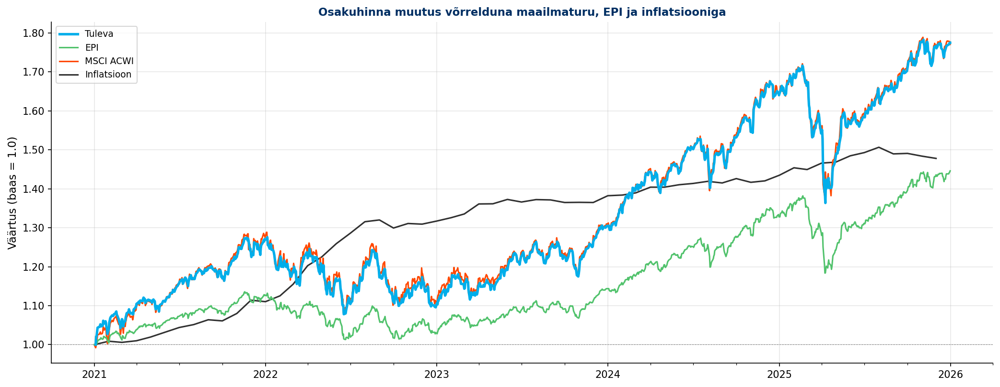

<!-- comment:cumulative_returns -->

<!-- /comment:cumulative_returns -->

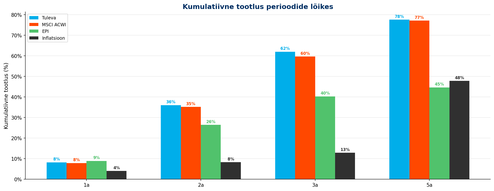

---

## 7. Tuleva finantstulemused

<!-- comment:financials -->

<!-- /comment:financials -->

| KPI | Juuli 2026 | YoY |
|---------|:---:|:---:|
| Brutomarginaal pärast litsentsitasu | 127,764 EUR | *-3%* |
| Tööjõukulud | -80,032 EUR | *-12%* |
| Mitmesugused tegevuskulud | -18,685 EUR | *12%* |
| Ebitda/ärikasum | 29,046 EUR | *20%* |
| Puhaskasum | 23,365 EUR | *20%* |
| **Litsentsitasu ühistule** | **60,419 EUR** | ***28%*** |

---

*Aruanne genereeritud [Tuleva Reporting Engine](https://github.com/TulevaEE/reporting-engine)'iga*