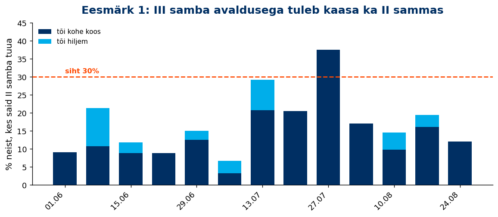
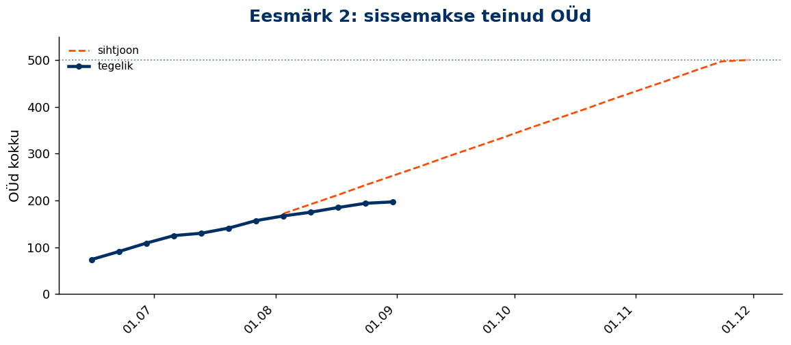
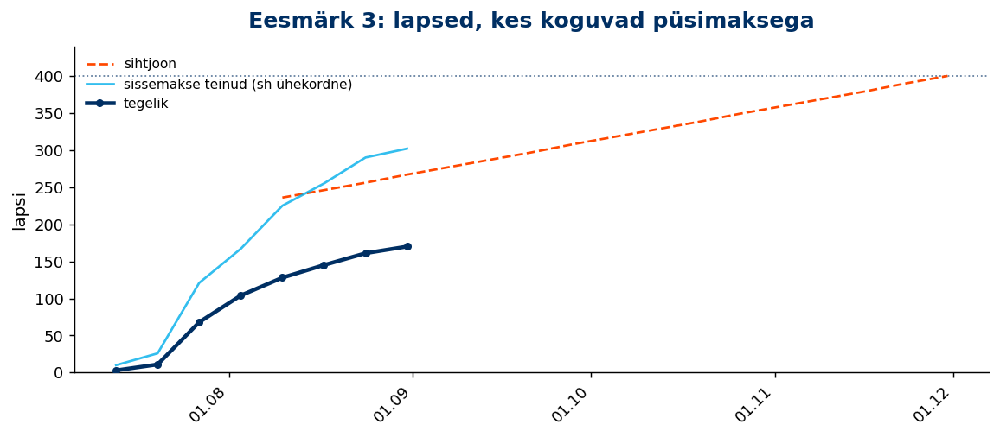
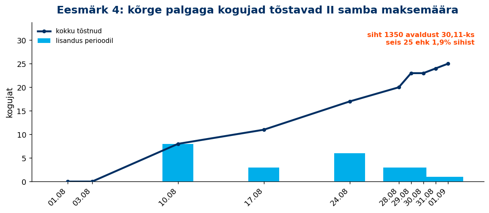
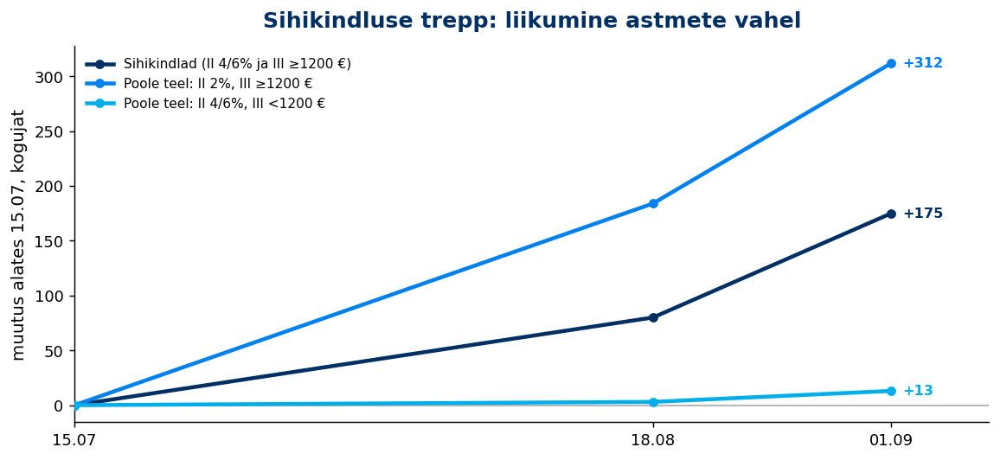

# Tuleva igakuine juhatuse aruanne

**August 2026**

*Aruande kuupäev: 2026-09-01*

---

## Selle vahetusperioodi eesmärgid

<!-- comment:vp_goals -->

<!-- /comment:vp_goals -->

| Eesmärk | Siht | Seis | Sihtjoon | Vahe |
|---|:---:|:---:|:---:|:---:|
| 1. III samba avaldusega tuleb kaasa ka II sammas | 30% | **13,6%** | – | −16,4 pp |
| 2. Sissemakse teinud OÜd | 500 | **197** | 253 | −56 |
| 3. Lapsed püsimaksega | 400 | **170** | 267 | −97 |
| 4. Kõrge palgaga kogujad tõstavad maksemäära | 1350 | **24** | – | −1 326 |

*Neli eesmärki, mille tiim sellele vahetusperioodile seadis (Metabase kaardid 2631–2634). „Sihtjoon" on lineaarne tempo sihini 30.11; eesmärkidel 1 ja 4 sihtjoont ei ole, seega on seal vahe arvestatud sihi enda suhtes.*

---

## 1. Varade maht ja kasv

<!-- comment:aum -->

<!-- /comment:aum -->

| KPI | August 2026 |
|---------|:---:|
| AUM kuu lõpus | 1752 M EUR |
| AUM 12 kuu kasv | 44% |
| sh sissemaksetest ja vahetustest | 21% |

<!-- comment:aum_waterfall -->

<!-- /comment:aum_waterfall -->

---

## 2. Uued kogujad

<!-- comment:savers -->

<!-- /comment:savers -->

| KPI | August 2026 |
|---------|:---:|
| Kogujate arv | 86,552 |
| sh ainult II sammas | 13,002 |
| sh ainult III sammas | 46,812 |
| sh II ja III sammas | 26,738 |
| YoY kasv | *7.5%* |

### Uued kogujad

<!-- comment:new_savers -->

<!-- /comment:new_savers -->

| KPI | August 2026 | YTD |
|---------|:---:|:---:|
| Uued kogujad | 428 | 4,457 |
| YoY muutus | *-5.1%* | |
| sh uued II samba kogujad | 182 | 2,439 |
| sh uued III samba kogujad | 420 | 3,925 |

### Kui sihikindlad on meie kogujad?

<!-- comment:determination -->

<!-- /comment:determination -->

| Grupp | Kogujaid | Osakaal |
|---------|:---:|:---:|
| **Sihikindlad** (II 4/6% ja III ≥ 1200 €) | 13,492 | 15.6% |
| **Sihikindla poole teel** | 26,622 | 30.8% |
| &nbsp;&nbsp;– II 4/6%, aga III < 1200 € | 17,870 | 20.6% |
| &nbsp;&nbsp;– II 2%, aga III ≥ 1200 € | 8,752 | 10.1% |
| Muud | 46,438 | 53.7% |
| **Kogujaid kokku** | **86,552** | **100,0%** |

*Hetkeseis. Segment (card 2324): II samba maksemäär × III samba viimase 12 kuu sissemaksed. Baas on aktiivsete kogujate arv (card 2578), sama mis tabelis 2 — "Muud" on jääk.*

#### Liikumine trepil

| Grupp | 15.07 | 18.08 | 01.09 | Muutus |
|---|:---:|:---:|:---:|:---:|
| **Sihikindlad** (II 4/6% ja III ≥ 1200 €) | 13 317 | 13 397 | 13 492 | +175 |
| **Sihikindla poole teel** | 26 297 | 26 484 | 26 622 | +325 |
| &nbsp;&nbsp;– II 4/6%, aga III < 1200 € | 17 857 | 17 860 | 17 870 | +13 |
| &nbsp;&nbsp;– II 2%, aga III ≥ 1200 € | 8 440 | 8 624 | 8 752 | +312 |
| Muud | 46 891 | 46 914 | 47 153 | +262 |
| **Aktiivseid kogujaid** | **86 505** | **86 795** | **87 267** | **+762** |

*Kaardil 2324 ajalugu ei ole, seega seeria on ehitatud kuupäevastatud hetktõmmistest ja algab juulist 2026; iga kuuga lisandub punkt. Baas on siin igal kuupäeval kaardi 2324 enda aktiivne alamhulk, mitte kaardi 2578 ametlik arv — seetõttu erineb viimane veerg paarisaja võrra ülaltoodud hetkeseisu tabelist.*

---

## 3. Sissemaksed

<!-- comment:contributions -->

<!-- /comment:contributions -->

| KPI | August 2026 | YoY | YTD | YoY |
|---------|:---:|:---:|:---:|:---:|
| II samba sissemaksed | 8.4 M EUR | *17.3%* | 65.5 M EUR | *19.7%* |
| III samba sissemaksed | 6.0 M EUR | *22.5%* | 49.1 M EUR | *17.2%* |
| **Sissemaksed kokku** | **14.4 M EUR** | ***19.4%*** | **114.6 M EUR** | ***18.6%*** |

<!-- comment:iii_contributions -->

<!-- /comment:iii_contributions -->

### III samba sissemakse tegijad

| KPI | August 2026 | YoY | YTD |
|---------|:---:|:---:|:---:|
| Sissemakse tegijate arv | 33,309 | *14.2%* | 41,370 |
| Püsimakse tegijate osakaal | 81.0% | | |

### II samba maksemäära muutmine

| KPI | August 2026 | YoY | Alates detsembrist | YoY |
|---------|:---:|:---:|:---:|:---:|
| Maksemäära tõstnud | 162 | *40.9%* | 1,380 | *-8.1%* |
| Maksemäära langetanud | 26 | *-58.1%* | 222 | *-56.0%* |

### Täiendavasse Kogumisfondi tehtud maksed

| KPI | August 2026 | YTD |
|---------|:---:|:---:|
| Sissemaksete summa | 2.7 M EUR | 15.9 M EUR |
| Sissemakse tegijate arv | 927 | |

---

## 4. Fondivahetused

<!-- comment:switching -->

<!-- /comment:switching -->

| KPI | August 2026 | YoY | YTD | YoY |
|---------|:---:|:---:|:---:|:---:|
| Sissevahetajate arv | 181 | *5.2%* | 2,397 | *-27.6%* |
| Ületoodud vara | 2.5 M EUR | *22.9%* | 38.6 M EUR | *-13.8%* |

<!-- comment:switching_conversion -->

<!-- /comment:switching_conversion -->

<!-- comment:switching_sources -->

<!-- /comment:switching_sources -->

---

## 5. Väljavoolud

<!-- comment:outflows -->

<!-- /comment:outflows -->

<!-- comment:drawdowns -->

<!-- /comment:drawdowns -->

| KPI | August 2026 | YoY | YTD |
|---------|:---:|:---:|:---:|
| II samba lahkujate vara | 0.5 M EUR | *-17.8%* | 8.9 M EUR |
| II samba väljujate vara | 0.4 M EUR | *-45.2%* | 10.2 M EUR |
| III sambast väljavõetud vara | 0.8 M EUR | *12.5%* | 7.5 M EUR |

---

## 6. Osakuhinna muutus

<!-- comment:unit_price -->

<!-- /comment:unit_price -->

<!-- comment:cumulative_returns -->

<!-- /comment:cumulative_returns -->

---

## 7. Tuleva finantstulemused

<!-- comment:financials -->

<!-- /comment:financials -->

| KPI | August 2026 | YoY |
|---------|:---:|:---:|
| Brutomarginaal pärast litsentsitasu | 127,764 EUR | *-3%* |
| Tööjõukulud | -80,032 EUR | *-12%* |
| Mitmesugused tegevuskulud | -18,685 EUR | *12%* |
| Ebitda/ärikasum | 29,046 EUR | *20%* |
| Puhaskasum | 23,365 EUR | *20%* |
| **Litsentsitasu ühistule** | **60,419 EUR** | ***28%*** |

---

*Aruanne genereeritud [Tuleva Reporting Engine](https://github.com/TulevaEE/reporting-engine)'iga*