# Tuleva igakuine juhatuse aruanne

**September 2026**

*Aruande kuupäev: 2026-10-01*

<a href="#dashboard">Tuleva missiooni dashboard</a> · <a href="#vp-eesmargid">Selle vahetusperioodi eesmärgid</a> · <a href="#tulemused">Tulemuste ülevaade</a>

<h2 id="dashboard" class="sektsioon" style="text-align:center">Tuleva missiooni dashboard</h2>

### Eesmärk: 100 000 sihikindlat kogujat

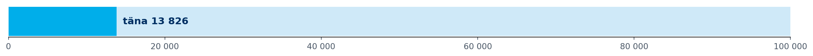

**13 879** sihikindlat kogujat (09.2026). Sihikindlaks kogujaks loeme seda, kes on tõstnud II samba maksemäära 4% või 6% peale ja kogub lisaks üle 1 200 euro aastas III sambasse. Sellise tempoga säästes on hea võimalus endale elu teiseks pooleks korralik kapital koguda.

Me ei tea, millal me eesmärgini jõuame, ega ürita seda ennustada. Meil on viis mõõdikut, mis näitavad meie eesmärgi poole liikumise kiirust ja kvaliteeti. Iga mõõdiku juures on ka tunnetus, milline võiks olla suurepärane tase ja milline kiirus võiks muret tekitada. Konkreetsed ajaliselt piiratud ja mõõdetavad eesmärgid leiad teisest sektsioonist: VP eesmärgid.

### Fondide jooksvate tasude määr

*Oleme lubanud: mida rohkem meid koos kogub, seda soodsamaks läheb kogumine meile kõigile. Varade mahu kasv peab järjekindlalt viima tasude alandamiseni.*

**0,28%** täna, siht 0,22% 3 mld € varade juures

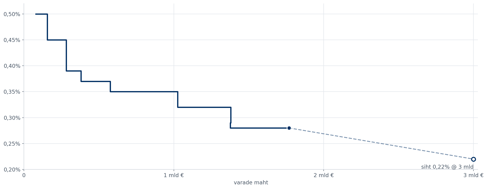

*X-telg on varade maht, mitte aeg: kulud ei lange ajas, vaid peavad langema mahu kasvuga. Iga aste on üks tasulangetus, maht selle kuu seisuga (kaart 2578).*

<!-- comment:kpi_21 -->

<!-- /comment:kpi_21 -->

### Varade mahu kasv sissemaksetest ja ületoomistest

*Kõige kindlam varade mahu kasvu allikas on inimeste regulaarsed sissemaksed ja ületoodav vara. Mida suuremaks kasvame, seda raskem on kasvutempot hoida.*

**261 M€** viimase 12 kuu kohta, +4,9% aasta varasemaga

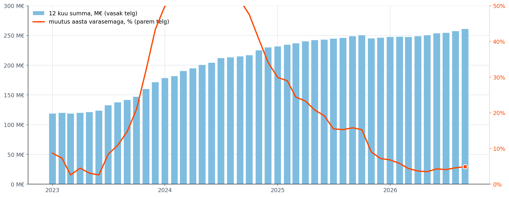

*Viimase 12 kuu II ja III samba sissemaksed ja ületoomised eurodes, tühistatud vahetused maha arvatud. Iga tulp on 12 kuu summa selle kuu seisuga, joon sama summa muutus aasta varasemaga. Kaart 2578.*

<!-- comment:kpi_22 -->

<!-- /comment:kpi_22 -->

### Uute kogujate lisandumine

*Mida rohkem inimesi Tulevas kogub, seda suurem on meie mõju. Meie kasv põhineb suuresti soovitustel: seega näitab uute kogujate arv seda, kui rahul on tänased kogujad.*

**661** inimest kuus, 12 kuu keskmine

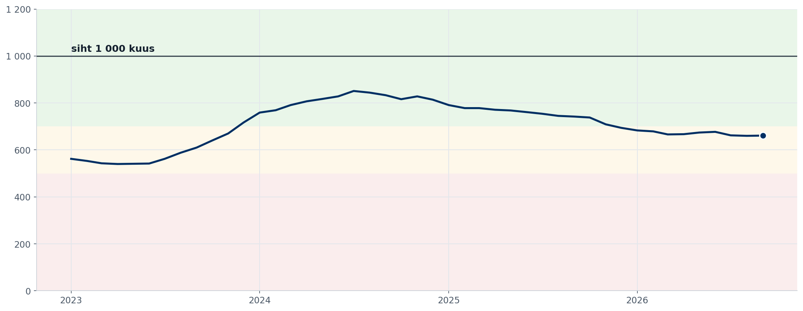

*12 kuu libisev keskmine: iga punkt on viimase 12 kuu uute kogujate arv jagatud 12-ga. Kaart 1516 (kuuaruande kaardi 1518 allikas, mis näitab ainult 13 kuud).*

<!-- comment:kpi_23 -->

<!-- /comment:kpi_23 -->

### Sihikindlad kogujad ja sihikindluse poole teel olijad

*Sihikindlaks kogujaks ei saa enamasti keegi ühe sammuga. Seepärast on sama oluline kui sihikindlate kogujate arv ka nende oma, kes on teinud teel järgmise sammu.*

**13 879** sihikindlat kogujat

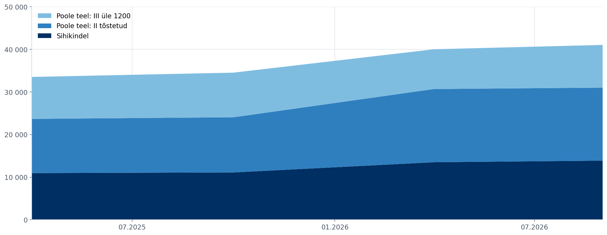

*Kaart 2741  poolaastad ja viimane kuu; snapshot-ajalugu algab 2025-04. II samba maksemäär on riiklik  seega teada ka siis  kui inimese II sammas on teises fondis: iga koguja on ühel trepiastmel. Jääk "muud" (45 734) ei ole graafikul.*

<!-- comment:kpi_24 -->

<!-- /comment:kpi_24 -->

### Lahkujad teise fondi

*Kui inimesed liiguvad meie juures kogudes oma eesmärgi suunas, siis nad ei lahku. Kõrgemat lahkujate määra ei saa asendada suurema uute kogujate pealevooluga: see ei ole lihtsalt pikaajaliselt jätkusuutlik.*

**1,2%** varade mahust aastas

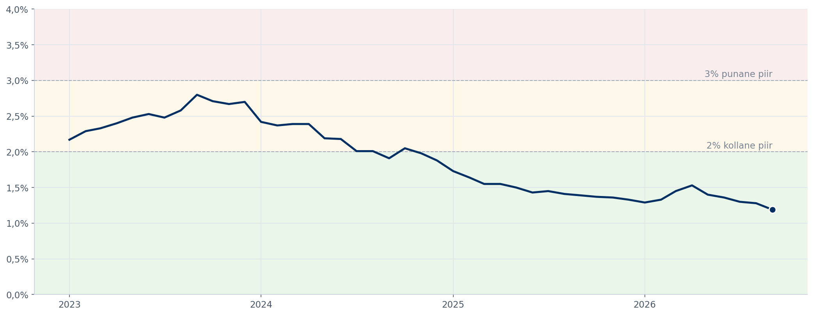

*Ainult teise fondi lahkujad, tühistatud avaldused maha arvatud; väljujad on eraldi rida. Nimetaja on varade maht 12 kuud tagasi. Kaart 2578.*

<!-- comment:kpi_25 -->

<!-- /comment:kpi_25 -->

### Tõsiste intsidentide arv (töös)

*Madalad kulud põhinevad operatsioonilisel efektiivsusel. Hästi automatiseeritud ja optimaalne ettevõte ei tee vigu.*

*mõõdik on ettevalmistamisel*

<!-- comment:kpi_26 -->

<!-- /comment:kpi_26 -->

<h2 id="vp-eesmargid" class="sektsioon" style="text-align:center">Selle vahetusperioodi eesmärgid</h2>

*Iga 4 kuu tagant seame algavaks vahetusperioodiks lühiajalised mõõdetavad eesmärgid, mida tahame vahetusperioodi lõpuks saavutada. Need on kitsad, puudutavad konkreetset kogujate gruppi ja järgmist sammu edukamal kogumisel, mida tahame neil aidata teha.*

<!-- comment:vp_goals -->

<!-- /comment:vp_goals -->

### III samba avaldusega tuleb kaasa ka II sammas

**13,0%** koos 21/162; hiljem lisandus 0; siht 30%

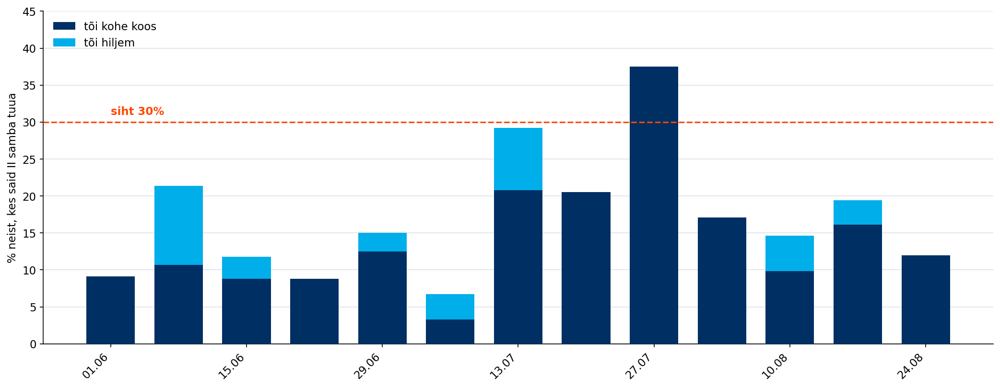

### Sissemakse teinud OÜd

**284** seis 28.09; siht 500, sihtjoon 334 (−50)

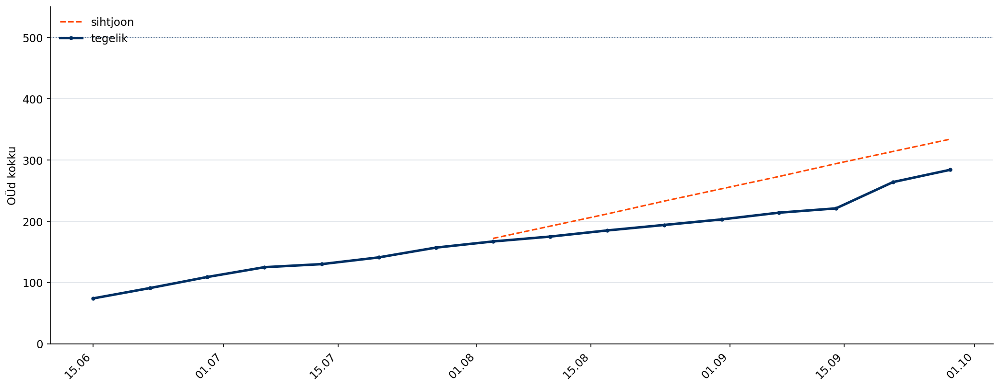

### Lapsed püsimaksega

**451** seis 28.09; siht 400, sihtjoon 308 (+143)

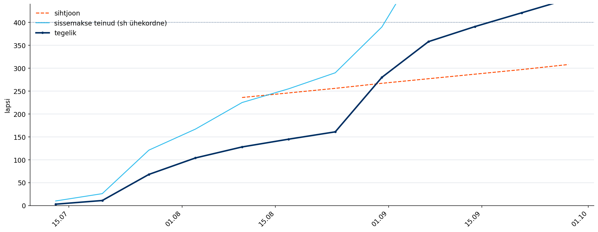

### Kõrge palgaga kogujad tõstavad maksemäära

**52** kohordist 4 512; seis 30.09; siht 1350

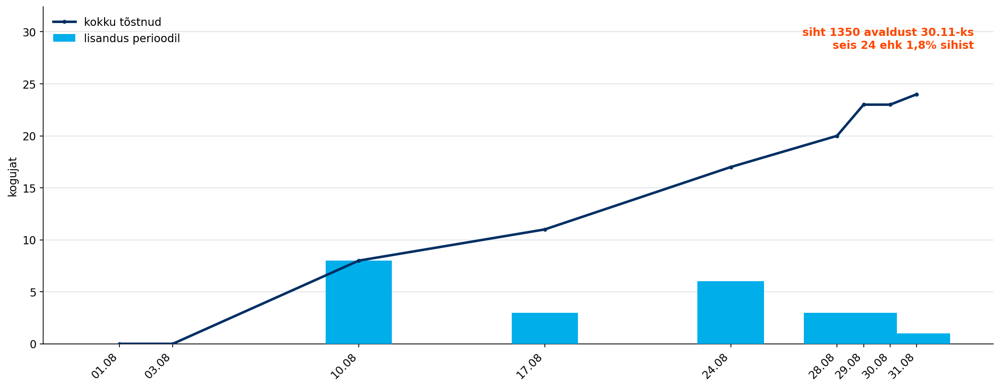

*Eesmärgid on Metabase kaartidel 2631–2634. „Sihtjoon" on lineaarne tempo sihini 30.11; II samba kaasatoomisel ja kõrge palgaga kogujate eesmärgil sihtjoont ei ole, seega on seal näha ainult seis ja siht.*

<h2 id="tulemused" class="sektsioon" style="text-align:center">Tulemuste ülevaade</h2>

### 1. Varade maht ja kasv

<!-- comment:aum -->

<!-- /comment:aum -->

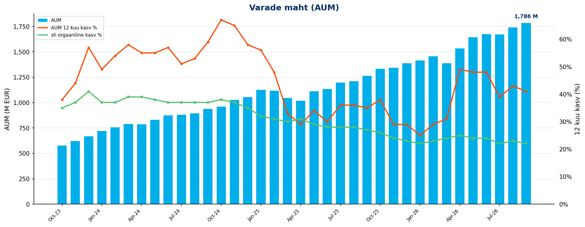

| KPI | September 2026 |
|---------|:---:|
| AUM kuu lõpus | 1786 M EUR |
| AUM 12 kuu kasv | 41% |
| sh sissemaksetest ja vahetustest | 21% |

<!-- comment:aum_waterfall -->

<!-- /comment:aum_waterfall -->

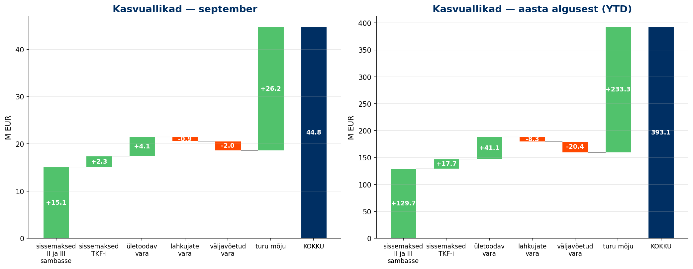

---

### 2. Uued kogujad

<!-- comment:savers -->

<!-- /comment:savers -->

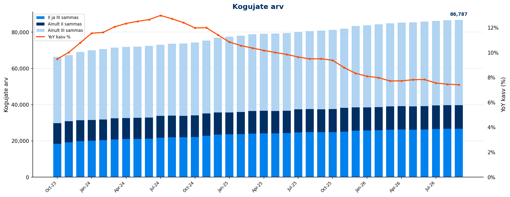

| KPI | September 2026 |
|---------|:---:|
| Kogujate arv | 86,787 |
| sh ainult II sammas | 12,884 |
| sh ainult III sammas | 47,151 |
| sh II ja III sammas | 26,752 |
| YoY kasv | *7.4%* |

### Uued kogujad

<!-- comment:new_savers -->

<!-- /comment:new_savers -->

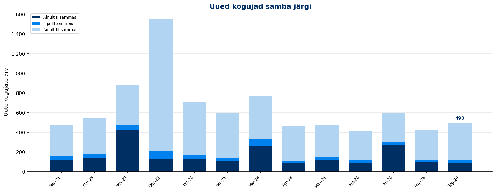

| KPI | September 2026 | YTD |
|---------|:---:|:---:|
| Uued kogujad | 490 | 4,947 |
| YoY muutus | *2.5%* | |
| sh uued II samba kogujad | 211 | 2,650 |
| sh uued III samba kogujad | 469 | 4,394 |

---

### 3. Sissemaksed

<!-- comment:contributions -->

<!-- /comment:contributions -->

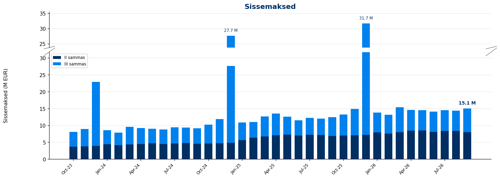

| KPI | September 2026 | YoY | YTD | YoY |
|---------|:---:|:---:|:---:|:---:|
| II samba sissemaksed | 8.0 M EUR | *16.3%* | 73.5 M EUR | *19.3%* |
| III samba sissemaksed | 7.0 M EUR | *26.8%* | 56.1 M EUR | *18.4%* |
| **Sissemaksed kokku** | **15.1 M EUR** | ***21.0%*** | **129.6 M EUR** | ***18.9%*** |

<!-- comment:iii_contributions -->

<!-- /comment:iii_contributions -->

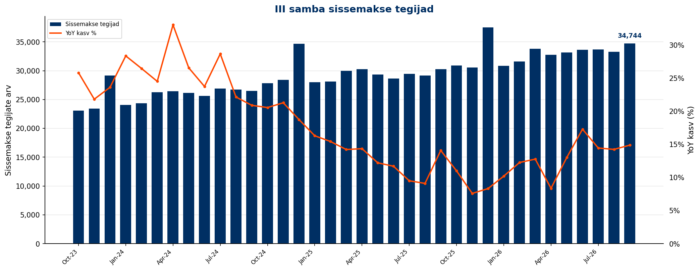

### III samba sissemakse tegijad

| KPI | September 2026 | YoY | YTD |
|---------|:---:|:---:|:---:|
| Sissemakse tegijate arv | 34,744 | *14.9%* | 42,533 |
| Püsimakse tegijate osakaal | 78.2% | | |

### II samba maksemäära muutmine

| KPI | September 2026 | YoY | Alates detsembrist | YoY |
|---------|:---:|:---:|:---:|:---:|
| Maksemäära tõstnud | 177 | *-30.6%* | 1,813 | *3.2%* |
| Maksemäära langetanud | 45 | *-49.4%* | 285 | *-51.9%* |

### Täiendavasse Kogumisfondi tehtud maksed

| KPI | September 2026 | YTD |
|---------|:---:|:---:|
| Sissemaksete summa | 2.3 M EUR | 17.7 M EUR |
| Sissemakse tegijate arv | 1,409 | |

---

### 4. Fondivahetused

<!-- comment:switching -->

<!-- /comment:switching -->

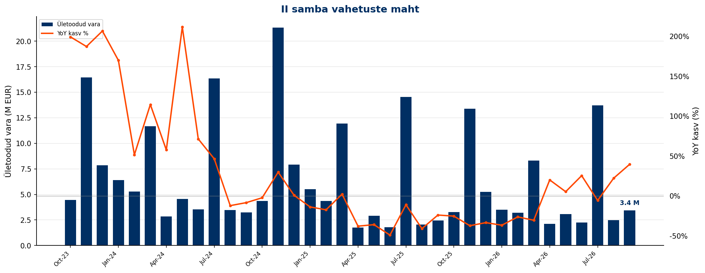

| KPI | September 2026 | YoY | YTD | YoY |
|---------|:---:|:---:|:---:|:---:|
| Sissevahetajate arv | 201 | *-7.8%* | 2,598 | *-26.4%* |
| Ületoodud vara | 3.4 M EUR | *39.6%* | 42.1 M EUR | *-11.0%* |

<!-- comment:switching_conversion -->

<!-- /comment:switching_conversion -->

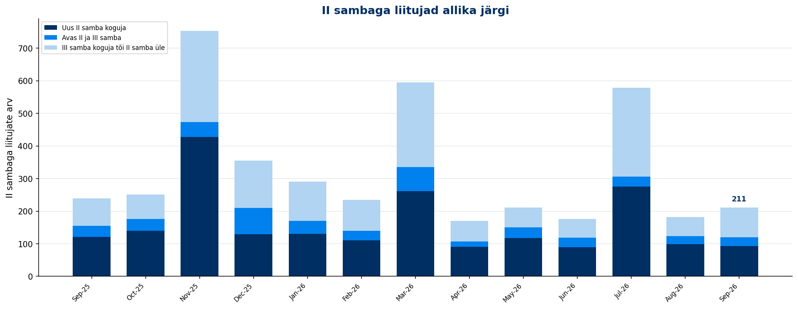

<!-- comment:switching_sources -->

<!-- /comment:switching_sources -->

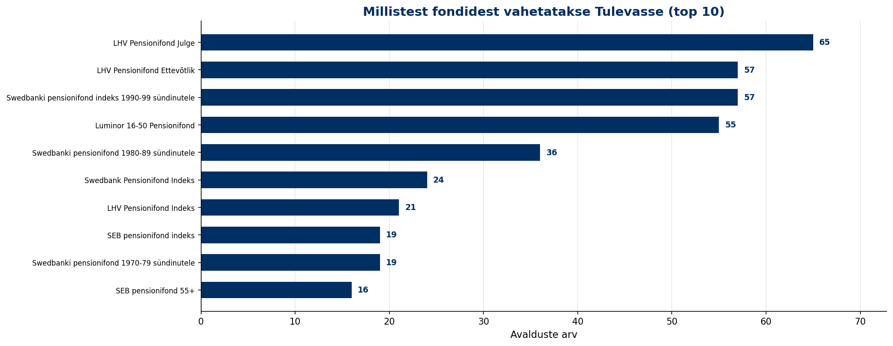

---

### 5. Väljavoolud

<!-- comment:outflows -->

<!-- /comment:outflows -->

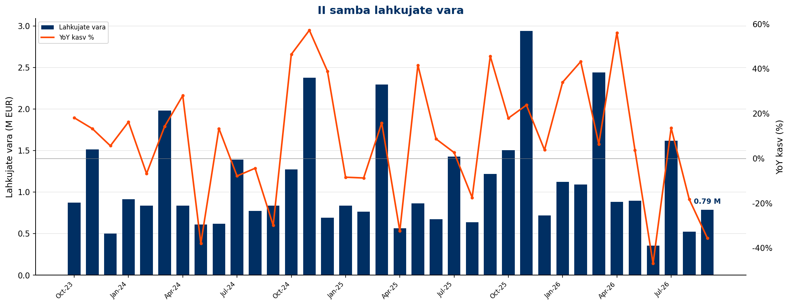

<!-- comment:drawdowns -->

<!-- /comment:drawdowns -->

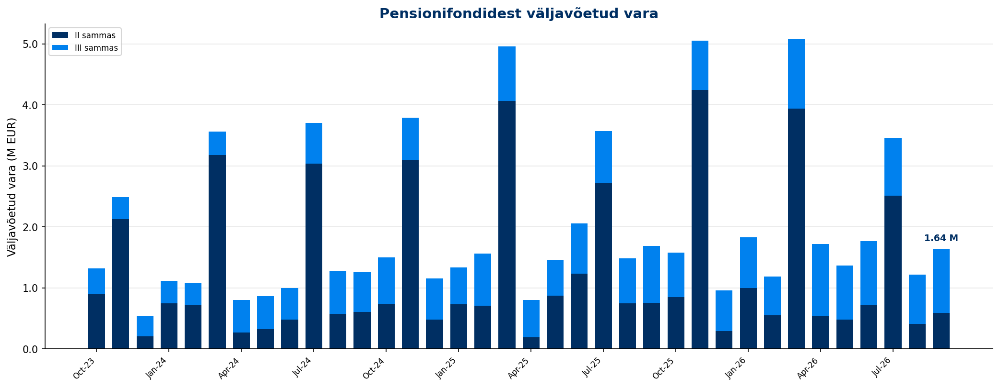

| KPI | September 2026 | YoY | YTD |
|---------|:---:|:---:|:---:|
| II samba lahkujate vara | 0.8 M EUR | *-35.6%* | 9.7 M EUR |
| II samba väljujate vara | 0.6 M EUR | *-21.0%* | 10.7 M EUR |
| III sambast väljavõetud vara | 1.0 M EUR | *12.4%* | 8.5 M EUR |

---

### 6. Osakuhinna muutus

<!-- comment:unit_price -->

<!-- /comment:unit_price -->

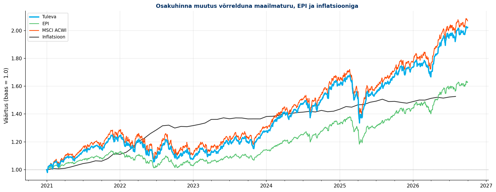

<!-- comment:cumulative_returns -->

<!-- /comment:cumulative_returns -->

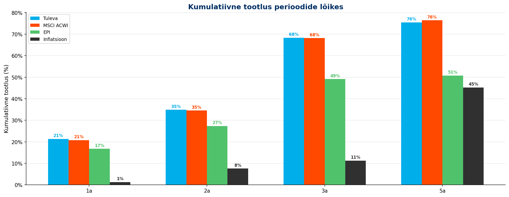

---

---

*Aruanne genereeritud [Tuleva Reporting Engine](https://github.com/TulevaEE/reporting-engine)'iga*